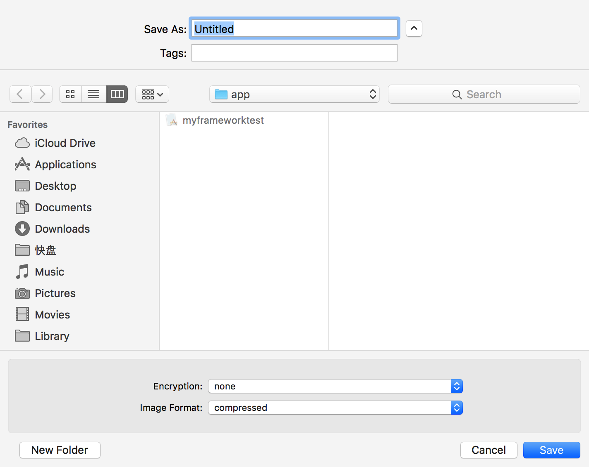

dmg是苹果电脑上专用的磁盘镜像（disk image）文件，类似于Windows平台上的iso镜像，dmg类似于一个压缩文档，支持压缩与加密，将程序与文档打包成dmg是一种比较流行的软件发布形式。

### 0x1 构建dmg
苹果官方系统自带的磁盘管理工具`Disk Utility`可以很方便的构建dmg文件，最简单的方法是启动/Applications/Utilies/Disk Utility，点击菜单File->New Image->Image From Folder...，从文件夹创建镜像，这一步，选择上一节的app目录，如图所示：

在Save As处输入要保存的文件名；Encryption处选择是否进行加密，none表示不加密，128-bit AES encryption是macOS版本10.3以前之前支持的128位的AES加密，258-bit AES encryption则是macOS版本10.5以后才开始支持的256位AES加密，在选择这两种中任意一种加密方式后，会弹出输入密码的对话框，提示输入的密码不是AES算法的加密key，只是一个用户自已设置的密码；设置好密码后，在Image Format处设置镜像的格式，read-only表示创建只读的镜像，compressed表示对镜像进行压缩，read/write表示镜像可读可写，DVD/CD master表示创建DVD镜像，hybrid image表示创建混合镜像。选择好选项后，点击Save铵钮，dmg就创建成功了。

除了使用图形界面创建dmg外，还可以使用命令行工具`hdiutil`来创建，例如为app目录下的myframeworktest.app创建一个AES128加密，密码为abc123的dmg镜像只需要执行如下命令即可：
```
$ hdiutil create -fs HFS+ -volname myframework  -srcfolder ../pkg_install_script/app -encryption AES-128 -stdinpass  -o myframeworktest_cmd.dmg
Enter disk image passphrase: //此处输入密码123
..
created: /Users/macbook/code/chapter4/dmg/myframeworktest_cmd.dmg
```
如果觉得从文件夹中创建的dmg不够个性化，完全可以使用`Disk Utility`创建自定义的dmg，自定义的dmg包括为dmg指定图标，背景图片，以及dmg文件的显示方式及大小。只需要打开`Disk Utility`，点击菜单File->New Image->Blank Image...，创建一个空白的镜像，在保存对话框中，设置镜像的大小、加密方式、分区格式及镜像格式，需要注意的是，此处镜像格式需要选择read/write disk image，创建成功后，打开镜像，将app目录中的文件复制进去，如果需要更换背景图片，只需要将背景图片复制到镜像中，使用`chflags`命令设置成隐藏格式，或者放放一个点“.”结尾的目录（点目录默认会隐藏显示），在镜像上右键，在弹出的菜单中选择Get Info，然后设置背景图片即可。操作完后，点击`Disk Utility`菜单的Images->Convert...，，选择操作后的dmg镜像，将该镜像压缩保存一下就可以发布了。

除了官网的`Disk Utility`外，也可以使用上一小节中介绍的`Luggage`工具，编译脚本后，执行“make dmg”来生成dmg文件。最后，还有一些第三方的工具也可以创建dmg镜像，比较知名的有`DropDMG`（下载地址：http://c-command.com/dropdmg ），从软件的名称上就可以判断，它支持快速的从文件拖放来创建dmg镜像，有兴趣的读者可以试试，它的使用比较简单，此处不再赘述。


### 0x2 管理dmg
dmg文件格式不是开放的，要想探索它的文件格式，可以逆向`hidutil`工具处理dmg的部分代码。在使用dmg的过程中，一种典型的可能遇到的场景是将dmg转换格式后，在Windows或Linux平台上使用，针对早期版本的dmg，网上有第三方的开方人员开发了`dmg2img`工具（下载地址：https://github.com/Lekensteyn/dmg2img ），方便将dmg转换成可以在Linux系统上挂载的镜像，还有一个工具`dmg2iso`（下载地址：https://sourceforge.net/projects/dmg2iso ），可以将dmg转换成Windows平台上使用的iso镜像，实际上该工具的底层是调用的`hdiutil`。

使用`hdiutil`来管理dmg已经足够了，它提供了查看、创建、转换dmg等功能，例如，查看myframeworktest.dmg的信息可以执行如下命令：
```
$ hdiutil imageinfo myframeworktest.dmg
Format Description: UDIF read-only compressed (zlib)
Class Name: CUDIFDiskImage
Checksum Type: CRC32
Size Information:
	Compressed Ratio: 0.022532451628704386
	Total Empty Bytes: 500224
	Sector Count: 5060
	Total Bytes: 2590720
	CUDIFEncoding-bytes-wasted: 7963
	Total Non-Empty Bytes: 2090496
	CUDIFEncoding-bytes-in-use: 47410
	Compressed Bytes: 47410
	CUDIFEncoding-bytes-total: 55373
Checksum Value: $404B6F25
Segments:
	......
	-1:
		Name: Protective Master Boot Record (MBR : 0)
		Partition Number: -1
		Checksum Type: CRC32
		Checksum Value: $0492F534
	2:
		Name:  (Apple_Free : 3)
		Partition Number: 2
		Checksum Type: CRC32
		Checksum Value: $00000000
Format: UDZO
Backing Store Information:
	......
partitions:
	partition-scheme: GUID
	block-size: 512
	partitions:
		0:
			partition-name: Protective Master Boot Record
			partition-start: 0
			partition-synthesized: true
			partition-length: 1
			partition-hint: MBR
		......
		7:
			partition-name: GPT Header
			partition-start: 5059
			partition-synthesized: true
			partition-length: 1
			partition-hint: Backup GPT Header
	burnable: false
udif-ordered-chunks: false
Properties:
	Encrypted: false
	Kernel Compatible: true
	Checksummed: true
	Software License Agreement: false
	Partitioned: false
	Compressed: true
Resize limits (per hdiutil resize -limits):
 min 	 cur 	 max
5060	5060	5060
```

将myframeworktest_cmd.dmg密码abc123更改为123abc只需执行如下命令：
```
$ hdiutil chpass ./myframeworktest_cmd.dmg
Enter password to access "myframeworktest_cmd.dmg":			//abc123
Enter a new password to secure "myframeworktest_cmd.dmg":	//123abc
Re-enter new password:		//123abc
```

将myframeworktest.dmg转换成iso格式可以执行如下命令：
```
$ hdiutil convert ./myframeworktest.dmg -format UDTO -o ./myframeworktest.cdr
Reading Protective Master Boot Record (MBR : 0)…
Reading GPT Header (Primary GPT Header : 1)…
Reading GPT Partition Data (Primary GPT Table : 2)…
Reading  (Apple_Free : 3)…
Reading disk image (Apple_HFS : 4)…
..............................................................................
Reading  (Apple_Free : 5)…
Reading GPT Partition Data (Backup GPT Table : 6)…
..............................................................................
Reading GPT Header (Backup GPT Header : 7)…
..............................................................................
Elapsed Time:   7.868ms
Speed: 314.0Mbytes/sec
Savings: 0.0%
created: /Users/.../code/chapter4/dmg/myframeworktest.cdr
$ mv ./myframeworktest.cdr ./myframeworktest.iso
```

另外，`DropDMG`也提供了很方便的dmg管理功能。例如，在文件夹上点击右键，在弹出的菜点中，选择Services->DropDMG:Use Current Configration，`DropDMG`就会使用当前默认的配置为文件夹在当前目录创建一个dmg，或者在dmg上点击右键，选择DropDMG:Ask for Options，来对dmg做一些修改，例如设置图标、修改密码、更改格式等。
