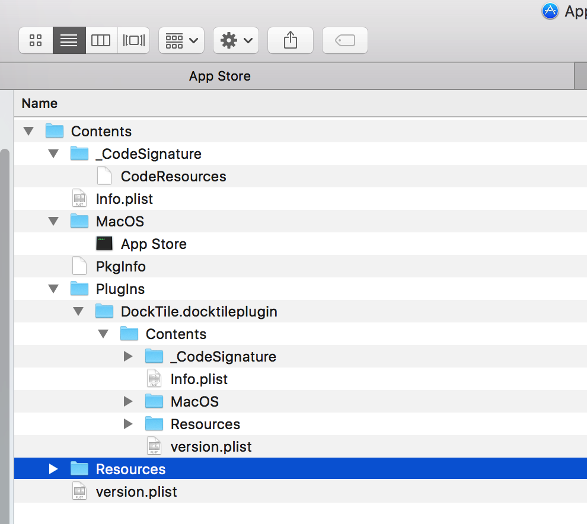

对于一个操作系统来说，对其影响最大的莫过于运行在它上面的软件，正因为这些形形色色软件的存在，操作系统才得以广泛应用。与Linux、Windows等主流操作系统一样，运行在macOS上的软件也有着自己独有的特点。

macOS上的软件有着自己独特的UI界面与操作方式。macOS的设计师一直秉承着自己的设计理念，设计出的Aqua界面别具风格。银灰的金属色主题始终是分辨macOS系统最快捷的一种方式，与Windows界面将最小按钮与关闭按钮设置到窗口右上角不同，Aqua界面的程序，最小化与关闭按钮位于软件的左上角，并且使用全屏按钮替换了Windows上的最大化按钮。进入全屏模式下的软件会新开一个窗口并占据屏幕的全部空间，可以在触摸板上使用三根手指左右划动来切换不同的全屏窗口。

每个常规的Aqua界面的程序都有一个菜单，菜单显示在用户屏幕的顶端，菜单的最左边始终是一个苹果图标，点击它会弹出系统设置、`App Store`、关机、重启等多个选项。
macOS使用Dock栏来管理显示常用的软件，它位于用户屏幕的底部，展示效果与Windows的任务栏相似，正在运行的macOS界面程序，都可以在Dock上右键点击该程序，在弹出的菜单中选择Options->Keep in Dock，将程序在Dock上保留下来，以后就可以直接从Dock中单击图标启动程序。
在Windows系统中，用户可以使用开始菜单->所有程序来找到系统中安装的软件并启动它，macOS中则提供了一个`Launchpad`程序来管理安装在/Applications目录中的软件。`Launchpad`移植于iOS系统中的`SpringBoard`，展示的效果也与之类似，它以全屏网格形式的界面显示了所有可以运行的软件与系统工具，如果软件安装过多，会以多个页面来展示。点击Dock上的`Launchpad`图标可以启动它，如图所示：

使用二根手指左右划动可以在不同的页面间切换。

### 0x0 可执行文件
除了Aqua界面的程序，macOS上还可以运行很多其它种类的文件，这里将所有可以运行在macOS系统上文件的统称为macOS可执行文件。

首先是脚本，macOS提供了UNIX系统中的Shell环境来支持运行脚本与命令行程序，脚本实质是一个文本文件，在脚本文件中指定运行它解释器后，Shell在运行脚本时，会调用解释器来解释运行它，任何一个文件都可以通过执行"chmod +x"命令给它加上可执行权限，拥有可执行权限的文件并不一定能执行，它必须是能满足某种解释器的语法规则才算得上可执行文件。
除了主流的几种Shell脚本支持外，macOS还内置了目前比较流行的`Perl`、`Python`和`Ruby`等脚本的解释器，任何人都可以直接编写`Perl`、`Python`和`Ruby`脚本并调用它们的解释器来运行，而不需要安装额外的软件。

另外，苹果公司还开发了一种脚本：AppleScript（苹果脚本）。它的作用是用于运行在macOS的程序并实际自动化工作的。苹果提供了一个单独的脚本编辑器来开发与调试AppleScript。它位于/Applications/Ｕtilities/Script Editor。使用`Script Editor`编写好的脚本保存的格式为scpt。随着macOS系统的不断升级，`AppleScript`也在不停的发展，目前甚至可以使用`AppleScript`来开发macOS上的界面程序。具体的步骤是在XCode中选择File->New->Project，在打开的对话框中选择Other->Cocoa-AppleScript。有兴趣的读者可以参看苹果的官方文档来深入了解AppleScript，地址上：https://developer.apple.com/library/mac/documentation/AppleScript/Conceptual/AppleScriptX/AppleScriptX.html 。

除了脚本外，可执行文件还包括可以由用户主动执行的程序与被动执行的程序文件。
主动执行的程序包括：GUI界面程序、命令行程序、游戏等；被动执行的程序包括被系统调用的程序，如：`Quick Look`插件、屏幕保护程序、内核驱动与扩展等，以及被程序调用的框架、库、Bundle、XPC服务等。所有的这些可执行文件都使用苹果独有的可执行文件格式Mach-O。关于Mach-O文件的格式，将在后面的小节中进行详细讲解。
### 0x1 下载与安装软件
苹果支持从自家的`App Store`应用商店直接安装软件，也支持从第三方渠道，如其它磁盘介质、网络下载来安装软件。从`App Store`下载软件是最方便快捷，也是最安全的一种方式，苹果公司一向以软件审查严格闻名，自家商店中的应用软件在界面、功能以及对系统资源的使用上，都是经常严格审查与限制的，对于普通用户来说，这种下载软件的方式最合适不过了，但对于专业用户来说，由于一些专业软件在用户授权协议、资源访问上或其它方面的原因未能在`App Store`上架，就只能从网络或第三方渠道来获取这类软件了。

#### 0x1.1 免费与付费软件
`App Store`应用商店上提供了丰富的免费与付费的软件供用户下载使用。下载免费的软件不需要用户付出额外的成本，只需要到官网https://appleid.apple.com/ 注册一个的帐号，使用帐号登录`App Store`就可以下载上面的免费软件了。
如果要下载`App Store`上面的收费软件，需要为帐号绑定一张银行卡，购买软件成功后会直接从银行卡中扣取费用。另外，`App Store`中的软件还支持另一种收费方式：`In-App Purchase`（应用内付费），简称IAP，这种收费方式在苹果自家的iOS系统中应用非常广泛，它允许开发人员为自己的软件某些特定功能设定为需要购买才能使用，目前，很多软件开发商以此平台作为主要的软件收入来源。

`App Store`中的收费软件只有IAP与直接购买这两种方式，而网络下载的收费软件的付费形式则丰富很多。部分软件官网只提供软件基础功能的演示版本供用户下载，如果需要使用正式版本，则需要联系软件开发商购买完整版本。例如著名的反汇编软件`IDA Pro`，官网就只提供了Demo版本可供下载：https://www.hex-rays.com/products/ida/support/download_demo.shtml ，正式版本需要找软件开发商或代理商购买。也有些软件的官网会提供完整版本下载，但会有使用时间或功能限制，如果需要正常无限制使用软件，则需要购买软件授权，如反汇编软件`Hopper`（http://hopperapp.com/）。还有部分软件与传统Window付费软件一样，使用用户名与注册码的形式来售卖软件，如`010 Editor`（http://www.sweetscape.com/010editor/）。

#### 0x1.2 安装软件
普通的macOS软件只是一个以扩展名.app结尾的目录，这种目录有着特定的组织结构，macOS将它称之为Bundle，安装这类软件只需要将Bundle复制到系统的/Applications目录即可，复制完成后，`Launchpad`面板会自动更新安装好的软件图标，启动软件不需要到/Applications目录中去寻找它，只需要打开`Launchpad`，找到软件的图标并点击就可以运行该程序了。
从网络上下载的软件通常是经过打包后发布的，普通的软件多是zip或其它方式压缩后，以压缩包的形式提供下载，还有的使用磁盘工具将软件打包成一个dmg磁盘镜像文件，这类dmg文件内通常还会有一个Applications目录的软链接，安装的时候，只需要将dmg中的软件直接拖放到该软链接上就算完成安装了。如图所示，是`AppDelete`的安装镜像：


macOS上的软件还有一种是以pkg或mpkg结尾的安装包，类似于Windows系统上的msi或exe安装程序，通过不停的点击下一步就可以完成安装，这类软件除了将主程序写入/Applications目录外，一般还会在系统上做一些只有管理员权限才能完成的动作，比如为特定的目录或文件创建软链接、安装与卸载内核扩展、复制命令行程序到用户可执行文件目录/usr/local/bin中等。因此，在安装的过程中，可能会提示输入管理员用户名与密码来执行需要Root权限的操作。

另一种是命令行工具，这类程序的安装使用第一章中介绍的`Homebrew`即可，此处不再赘述。


### 0x3 Bundle
Bundle是苹果系统独有的特色，在苹果系统上大量中使用了Bundle。

#### 0x3.1 Bundle目录结构
安装到macOS系统上的软件有着自己特定的格式，它们是以.app扩展名结尾的Bundle目录结构。Bundle有着固定的组织格式，在Finder中查看Bundle的目录内容，可以在程序上点右键，在弹出的菜单中选择Show Package Contents，查看Bundle的目录结构。以/Applications目录下`App Store`为例，它的目录结构如图所示：


在App Store.app目录下，只有一个Contents子目录，所有软件的内容都在此目录下。它们包括：
- CodeSignature目录。此目录下只有一个CodeResources文件，它是一个plist格式的文件，保存了软件包中所有文件的签名信息。
- info.plist文件。此文件记录了软件的一些信息。如软件构建的机器的版本`BuildMachineOSBuild`、可执行文件名`CFBundleExecutable`、软件的标识`CFBundleIdentifier`、软件包名`CFBundleName`等。
- MacOS目录。此目录存放了可执行文件。
- Pkginfo文件。软件包的8字节的标识符。
- Resources目录。软件运行所需要的资源，包括.iproj本地化资源、.nib资源、图片、字体、声音、文档以及其它文件。
- Plugins目录。插件目录，存放了软件用到的插件，插件也是使用Bundle目录结构进行组织的一种程序。

除了Plugins目录外，根据软件需求与实现的不同，Contents下可能还会有Frameworks与XPCServices目录，Frameworks里面存放了软件需要用到的框架，它是以.framework结尾的Bundle结构；XPCServices则存放了软件用到的XPC服务，它是以.xpc结尾的Bundle结构，还有一种以.bundle扩展名结尾的Bundle，它是“纯粹”的Bundle，目录结构与其它的Bundle无异，存放的内容可以是二进制代码，也可以是资源，也可以二者同时存放，如果存放二进制代码的话，可供程序在代码中使用`dlopen()`函数打开，这种Bundle通常用于制作软件的插件，存放在软件Bundle的Resources目录下。


#### 0x3.2 代码中访问Bundle
在程序中，开发人员可以使用`Cocoa`框架提供的`NSBundle`类来获取程序的Bundle信息。调用`NSBundle`的`mainBundle()`方法可以返回当前程序的主Bundle对象，调用方法如下：
```
NSBundle *bundle = [NSBundle mainBundle]
```
使用主Bundle对象的`infoDictionary()`方法可以访问软件Bundle目录下info.plist文件中的信息，它返回的是一个字典对象，如下所示是获取程序标识符的代码：
```
[[[NSBundle mainBundle] infoDictionary] objectForKey:@"CFBundleIdentifier"]]
```
使用主Bundle对象的`pathForResource()`方法可以访问Bundle目录下任意资源文件。如下所示是访问Bundle根目录下的monkey.png文件：
```
NSString *monkey = [[NSBundle mainBundle] pathForResource:@"monkey" ofType:@"png"];
```
与主Bundle对应的是自定义Bundle，这一类Bundle的访问可以这样调用：
```
NSString *resourceBundle = [[NSBundle mainBundle] pathForResource:@"ResPack" ofType:@"bundle"];
NSLog(@"resourceBundle: %@", resourceBundle);
NSString *monkey = [[NSBundle bundleWithPath:resourceBundle] pathForResource:@"monkey"
			ofType:@"png" inDirectory:@"Images"];

NSLog(@"monkey path: %@", monkey);
```
上面这段代码访问了ResPack.bundle中Images目录下的monkey.png文件。
