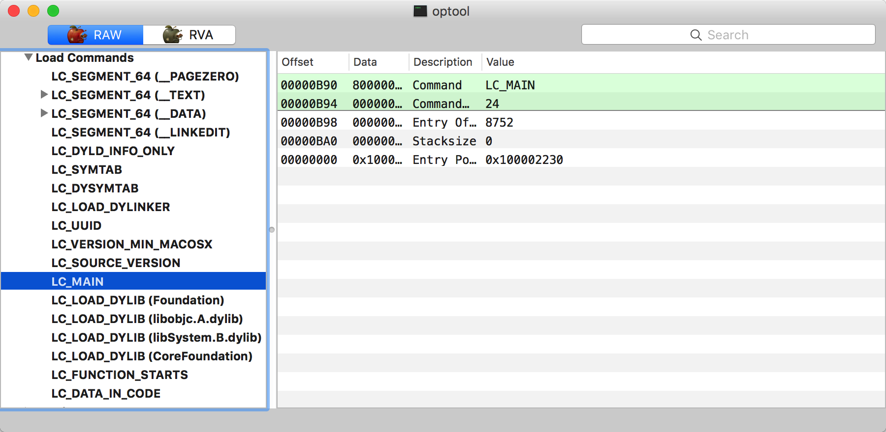
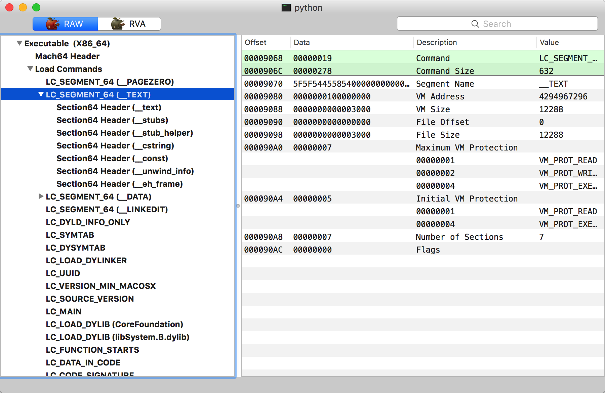

## 0x1 通用二进制格式
虽然macOS系统使用了很多UNIX上的特性，但它并没有使用ELF作为系统的可执行文件格式，而是使用自家独创的Mach-O文件格式。

macOS系统一路走来，支持的CPU及硬件平台都有了很大的变化，从早期的PowerPC平台，到后来的x86，再到现在主流的arm、x86-64平台。软件开发人员为了做到不同硬件平台的兼容性，如果需要为每一个平台编译一个可执行文件，这将是非常繁琐的。为了解决软件在多个硬件平台上的兼容性问题，苹果开发了一个通用的二进制文件格式（Universal Binary）。
又称为胖二进制（Fat Binary），通用二进制文件中将多个支持不同CPU架构的二进制文件打包成一个文件，系统在加载运行该程序时，会根据通用二进制文件中提供的多个架构来与当前系统平台做匹配，运行适合当前系统的那个版本。

苹果自家系统中存在着很多通用二进制文件。比如/usr/bin/python，在终端中执行`file`命令可以查看它的信息：
```
$ file /usr/bin/python
/usr/bin/python: Mach-O universal binary with 2 architectures
/usr/bin/python (for architecture x86_64):	Mach-O 64-bit executable x86_64
/usr/bin/python (for architecture i386):	Mach-O executable i386
```

系统提供了一个命令行工具`lipo`来操作通用二进制文件。它可以添加、提取、删除以及替换通用二进制文件中特定架构的二进制版本。例如提取`python`中x86_64版本的二进制文件可以执行：
```
lipo /usr/bin/python -extract x86_64 -output ~/Desktop/python.x64
```
删除x86版本的二进制文件可以执行：
```
lipo /usr/bin/python -remove i386 -output ~/Desktop/python.x64
```
或者直接瘦身为x86_64版本：
```
lipo /usr/bin/python -thin x86_64 -output ~/Desktop/python.x64
```
通用二进制的“通用”不止针对可以直接运行的可执行程序，系统中的动态库dylib、静态库.a文件以及框架等都可以是通用二进制文件，对它们也可以同样使用`lipo`命令来进行管理。
下来看一下通用二进制的文件格式。安装好macOS程序开发的SDK后，或者在xnu的内核源码中，都可以在&lt;mach-o/fat.h&gt;文件中找到通用二进制文件格式的声明。从文件命名上看，将通用二进制称为胖二进制更方便一些。胖二进制头部结构`fat_header`定义如下：
```
#define FAT_MAGIC	0xcafebabe
#define FAT_CIGAM	0xbebafeca	/* NXSwapLong(FAT_MAGIC) */

struct fat_header {
	uint32_t	magic;		/* FAT_MAGIC */
	uint32_t	nfat_arch;	/* number of structs that follow */
};
```
`magic`字段被定义为常量`FAT_MAGIC`，它的取值是固定的0xcafebabe，表示这是一个通用的二进制文件。`nfat_arch`字段指明了通用二进制中包含多少个Mach-O文件。
每个通用二进制架构信息都使用`fat_arch`结构表示，在`fat_header`结构体之后，紧接着的是一个或多个连续的`fat_arch`结构体，它的定义如下：
```
struct fat_arch {
	cpu_type_t	cputype;	/* cpu specifier (int) */
	cpu_subtype_t	cpusubtype;	/* machine specifier (int) */
	uint32_t	offset;		/* file offset to this object file */
	uint32_t	size;		/* size of this object file */
	uint32_t	align;		/* alignment as a power of 2 */
};
```
`cputype`指定了具体的cpu类型，它的类型是`cpu_type_t`，定义位于mach/machine.h中。`cpu`的常用类型主要有如下几种：
```
#define CPU_TYPE_X86		((cpu_type_t) 7)
#define CPU_TYPE_I386		CPU_TYPE_X86		
#define	CPU_TYPE_X86_64		(CPU_TYPE_X86 | CPU_ARCH_ABI64)
#define CPU_TYPE_MC98000	((cpu_type_t) 10)
#define CPU_TYPE_HPPA           ((cpu_type_t) 11)
#define CPU_TYPE_ARM		((cpu_type_t) 12)
#define CPU_TYPE_ARM64          (CPU_TYPE_ARM | CPU_ARCH_ABI64)
#define CPU_TYPE_MC88000	((cpu_type_t) 13)
#define CPU_TYPE_SPARC		((cpu_type_t) 14)
#define CPU_TYPE_I860		((cpu_type_t) 15)
#define CPU_TYPE_POWERPC		((cpu_type_t) 18)
#define CPU_TYPE_POWERPC64		(CPU_TYPE_POWERPC | CPU_ARCH_ABI64
```
macOS平台上的CPU类型一般为`CPU_TYPE_X86_64`。

`cpusubtype`指定了cpu的子类型。它的类型是`cpu_subtype_t`。cpu子类型主要有如下几种：
```
#define CPU_SUBTYPE_MASK	0xff000000
#define CPU_SUBTYPE_LIB64	0x80000000
#define CPU_SUBTYPE_X86_ALL		((cpu_subtype_t)3)
#define CPU_SUBTYPE_X86_64_ALL		((cpu_subtype_t)3)
#define CPU_SUBTYPE_X86_ARCH1		((cpu_subtype_t)4)
#define CPU_SUBTYPE_X86_64_H		((cpu_subtype_t)8)
......
```
cpu子类型一般`CPU_SUBTYPE_LIB64`与`CPU_SUBTYPE_X86_64_ALL`比较常见。

`offset`字段指明了当前cpu架构数据相对于当前文件开头的偏移值。`size`字段指明了数据的大小。

`align`字段指明了数据的内存对齐边界，取值必须是2的次方，它确保了当前cpu架构的目标文件加载到内存中时，数据是经过内存优化对齐的。

可以使用`otool`工具打印本机安装的`python`程序的`fat_header`信息。如下：
```
otool -f -V /usr/bin/python
Fat headers
fat_magic FAT_MAGIC
nfat_arch 2
architecture i386
    cputype CPU_TYPE_I386
    cpusubtype CPU_SUBTYPE_I386_ALL
    capabilities 0x0
    offset 4096
    size 29632
    align 2^12 (4096)
architecture x86_64
    cputype CPU_TYPE_X86_64
    cpusubtype CPU_SUBTYPE_X86_64_ALL
    capabilities CPU_SUBTYPE_LIB64
    offset 36864
    size 29872
    align 2^12 (4096)
```
如果你是UNIX的使用者，经常使用GNU里面`binutils`提供的`objdump`查看可执行文件信息的话，在macOS上可以使用它的移植版本`gobjdump`，使用`HomeBrew`运行以下命令进行安装：
```
$ brew install binutils
```
完装完成后，执行下面的命令也可以查看`python`程序的`fat_header`信息：
```
$ gobjdump -f /usr/bin/python
In archive /usr/bin/python:

i386:     file format mach-o-i386
architecture: i386, flags 0x00000012:
EXEC_P, HAS_SYMS
start address 0x00001be0

i386:x86-64:     file format mach-o-x86-64
architecture: i386:x86-64, flags 0x00000012:
EXEC_P, HAS_SYMS
start address 0x0000000100000e20
```

在`fat_arch`结构体往下就是具体的Mach-O文件格式了，它的内容复杂得多，将在下一小节进行讨论。


## 0x2 Mach-O文件格式简介
Mach-O（Mach Object File Format）描述了macOS系统上可执行文件的格式。熟悉Mach-O文件格式，有助于了解苹果底层软件运行机制，更好的掌握`dyld`加载Mach-O的步骤，为自己动手开发Mach-O相关的加解密工具打下基础。

一个典型的Mach-O文件格式如图所示：

通过上图，可以看出Mach-O主要由以下三部分组成：
- Mach-O头部（mach header）。描述了Mach-O的cpu架构、文件类型以及加载命令等信息。
- 加载命令（load command）。描述了文件中数据的具体组织结构，不同的数据类型使用不同的加载命令表示。
- Data。Data中的每个段（segment）的数据都保存在这里，段的概念与ELF文件中段的概念类似。每个段都有一个或多个Section，它们存放了具体的数据与代码。


## 0x3 Mach-O头部
与Mach-O文件格式有关的结构体，都可以直接或间接的在”mach-o/loader.h“文件中找到。
针对32位与64位架构的cpu，分别使用了`mach_header`与`mach_header_64`结构体来描述Mach-O头部。
`mach_header`结构体的定义如下：
```
struct mach_header {
	uint32_t	magic;		/* mach magic number identifier */
	cpu_type_t	cputype;	/* cpu specifier */
	cpu_subtype_t	cpusubtype;	/* machine specifier */
	uint32_t	filetype;	/* type of file */
	uint32_t	ncmds;		/* number of load commands */
	uint32_t	sizeofcmds;	/* the size of all the load commands */
	uint32_t	flags;		/* flags */
};
```
`magic`字段与`fat_header`结构体中的`magic`字段一样，表示Mach-O文件的魔数值，对于32位架构的程序来说，它的取值是`MH_MAGIC`，固定为0xfeedface。
`cputype`与`cpusubtype`字段与`fat_header`结构体中的含义完全相同。
`filetype`字段表示Mach-O的具体文件类型。它的取值有：
```
#define	MH_OBJECT	0x1		/* relocatable object file */
#define	MH_EXECUTE	0x2		/* demand paged executable file */
#define	MH_FVMLIB	0x3		/* fixed VM shared library file */
#define	MH_CORE		0x4		/* core file */
#define	MH_PRELOAD	0x5		/* preloaded executable file */
#define	MH_DYLIB	0x6		/* dynamically bound shared library */
#define	MH_DYLINKER	0x7		/* dynamic link editor */
#define	MH_BUNDLE	0x8		/* dynamically bound bundle file */
#define	MH_DYLIB_STUB	0x9		/* shared library stub for static */
					/*  linking only, no section contents */
#define	MH_DSYM		0xa		/* companion file with only debug sections */
#define	MH_KEXT_BUNDLE	0xb		/* x86_64 kexts */
```
这里主要关注`MH_EXECUTE`、`MH_DYLIB`与`MH_DYLIB`这3个文件格式。

接下来的`ncmds`指明了Mach-O文件中加载命令（load commands）的数量。

`sizeofcmds`字段指明了Mach-O文件加载命令（load commands）所占的总字节大小。

`flags`字段表示文件标志，它是一个含有一组位标志的整数，指明了Mach-O文件的一些标志信息。可用的值有：
```
#define	MH_NOUNDEFS	0x1
#define	MH_INCRLINK	0x2
#define MH_DYLDLINK	0x4
#define MH_LAZY_INIT 0x40
#define MH_TWOLEVEL	0x80
#define MH_PIE 0x200000
......
```
针对64位Mach-O的`mach_header_64`结构体定义如下：
```
struct mach_header_64 {
	uint32_t	magic;		/* mach magic number identifier */
	cpu_type_t	cputype;	/* cpu specifier */
	cpu_subtype_t	cpusubtype;	/* machine specifier */
	uint32_t	filetype;	/* type of file */
	uint32_t	ncmds;		/* number of load commands */
	uint32_t	sizeofcmds;	/* the size of all the load commands */
	uint32_t	flags;		/* flags */
	uint32_t	reserved;	/* reserved */
};
```
相比`mach_header`，它多出了一个`reserved`字段，目前它的取值系统保留。`mach_header_64`结构体中的字段与`mach_header`中的基本一致，除了`magic`字段的取值是`MH_MAGIC_64`，固定的值为0xfeedfacf。
学习Mach-o文件格式时，可以使用辅助工具查看具体的文件结构，这样效果更加直观。
下图是`MachOView`查看`optool`程序Mach64 Header的效果：

下图是`010 Editor`查看`optool`程序Mach64 Header的效果：

下图是`Synalyze It!`查看`optool`程序Mach64 Header的效果：

这三款工具对于学习Mach-O文件格式都是非常有帮助的，读者在实际分析时可以多多使用。


## 0x4 加载命令
在`mach_header`之后的是Load Command加载命令，这些加载命令在Mach-O文件加载解析时，被内核加载器或者动态链接器调用，基本的加载命令的数据结构如下：
```
struct load_command {
	uint32_t cmd;		/* type of load command */
	uint32_t cmdsize;	/* total size of command in bytes */
};
```
此结构对应的成员只有2个：`cmd`字段代表当前加载命令的类型。`cmdsize`字段代表当前加载命令的大小。
cmd的类型不同，所代表的加载命令的类型就不同，它的结构体也会有所不一样，对于不同类型的加载命令，它们都会在`load_command`结构体后面加上一个或多个字段来表示自己特定的结构体信息。

macOS系统在进化的过程中，加载命令算是比较频繁被更新的一个数据结构体，截止到macOS 10.12系统，加载命令的类型cmd的取值共有48种。它们的部分定义如下：
```
#define	LC_SEGMENT	0x1	/* segment of this file to be mapped */
#define	LC_SYMTAB	0x2	/* link-edit stab symbol table info */
#define	LC_SYMSEG	0x3	/* link-edit gdb symbol table info (obsolete) */
#define	LC_THREAD	0x4	/* thread */
#define	LC_UNIXTHREAD	0x5	/* unix thread (includes a stack) */
#define	LC_LOADFVMLIB	0x6	/* load a specified fixed VM shared library */
#define	LC_IDFVMLIB	0x7	/* fixed VM shared library identification */
#define	LC_IDENT	0x8	/* object identification info (obsolete) */
#define LC_FVMFILE	0x9	/* fixed VM file inclusion (internal use) */
#define LC_PREPAGE      0xa     /* prepage command (internal use) */
#define	LC_DYSYMTAB	0xb	/* dynamic link-edit symbol table info */
#define	LC_LOAD_DYLIB	0xc	/* load a dynamically linked shared library */
......
#define	LC_ENCRYPTION_INFO_64 0x2C /* 64-bit encrypted segment information */
#define LC_LINKER_OPTION 0x2D /* linker options in MH_OBJECT files */
#define LC_LINKER_OPTIMIZATION_HINT 0x2E /* optimization hints in MH_OBJECT files */
#ifndef __OPEN_SOURCE__
#define LC_VERSION_MIN_TVOS 0x2F /* build for AppleTV min OS version */
#endif /* __OPEN_SOURCE__ */
#define LC_VERSION_MIN_WATCHOS 0x30 /* build for Watch min OS version */
```
所有的这些加载命令由系统内核加载器直接使用，或由动态链接器处理。其中几个常见的加载命令有`LC_SEGMENT`、`LC_LOAD_DYLINKER`、`LC_LOAD_DYLIB`、`LC_MAIN`、`LC_CODE_SIGNATURE`、`LC_ENCRYPTION_INFO`等。

`LC_SEGMENT`：表示这是一个段加载命令，需要将它加载到对应的进程空间上去。段加载命令将在下一小节进行讨论。

`LC_LOAD_DYLIB`：表示这是一个需要动态加载的链接库。它使用`dylib_command`结构体表示。定义如下：
```
struct dylib_command {
	uint32_t	cmd;		/* LC_ID_DYLIB, LC_LOAD_{,WEAK_}DYLIB,LC_REEXPORT_DYLIB */
	uint32_t	cmdsize;	/* includes pathname string */
	struct dylib dylib;		/* the library identification */
};
```
当cmd类型时`LC_ID_DYLIB`、`LC_LOAD_DYLIB`、`LC_LOAD_WEAK_DYLIB`与`LC_REEXPORT_DYLIB`时，统一使用`dylib_command`结构体表示。
它使用dylib结构体来存储要加载的动态库的具体信息。如下：
```
struct dylib {
    union lc_str  name;			/* library's path name */
    uint32_t timestamp;			/* library's build time stamp */
    uint32_t current_version;		/* library's current version number */
    uint32_t compatibility_version;	/* library's compatibility vers number*/
};
```
`name`字段是动态库的完整路径，动态链接器在加载动态库时，通用此路径来进行加载它。
`timestamp`字段描述了动态库构建时的时间戳。`current_version`与`compatibility_version`指明了前当版本与兼容的版本号。

`LC_MAIN`：此加载命令记录了可执行文件的主函数`main()`的位置。它使用`entry_point_command`结构体表示。定义如下：
```
struct entry_point_command {
    uint32_t  cmd;	/* LC_MAIN only used in MH_EXECUTE filetypes */
    uint32_t  cmdsize;	/* 24 */
    uint64_t  entryoff;	/* file (__TEXT) offset of main() */
    uint64_t  stacksize;/* if not zero, initial stack size */
};
```
`entryoff`字段中就指定了`main()`函数的文件偏移。`stacksize`指定了初始的堆栈大小。


## 0x5 LC_CODE_SIGNATURE与代码签名过程分析
`LC_CODE_SIGNATURE`：代码签名加载命令。描述了Mach-O的代码签名信息，它属于链接信息，使用`linkedit_data_command`结构体表示。定义如下：
```
struct linkedit_data_command {
    uint32_t	cmd;		/* LC_CODE_SIGNATURE, LC_SEGMENT_SPLIT_INFO,
                                   LC_FUNCTION_STARTS, LC_DATA_IN_CODE,
				   LC_DYLIB_CODE_SIGN_DRS or
				   LC_LINKER_OPTIMIZATION_HINT. */
    uint32_t	cmdsize;	/* sizeof(struct linkedit_data_command) */
    uint32_t	dataoff;	/* file offset of data in __LINKEDIT segment */
    uint32_t	datasize;	/* file size of data in __LINKEDIT segment  */
};
```
`dataoff`字段指明了相对于`__LINKEDIT`段的文件偏移位置，`datasize`字段指明了数据的大小。
由于`dataoff`与`datasize`分别指明了代码签名的位置与大小，那么笔者在此提个问：如何删除Mach-O中包含的代码签名信息？

与代码签名相关的数据定义可以在xnu内核代码的“bsd/sys/codesign.h”文件中找到。整个代码签名部分的头部使用一个`CS_SuperBlob`结构体定义，它的原型如下：
```
typedef struct __SC_SuperBlob {
	uint32_t magic;					/* magic number */
	uint32_t length;				/* total length of SuperBlob */
	uint32_t count;					/* number of index entries following */
	CS_BlobIndex index[];			/* (count) entries */
	/* followed by Blobs in no particular order as indicated by offsets in index */
} CS_SuperBlob;
```
`magic`字段指明了Blob的类型，可选值如下：
```
enum {
	CSMAGIC_REQUIREMENT = 0xfade0c00,		/* single Requirement blob */
	CSMAGIC_REQUIREMENTS = 0xfade0c01,		/* Requirements vector (internal requirements) */
	CSMAGIC_CODEDIRECTORY = 0xfade0c02,		/* CodeDirectory blob */
	CSMAGIC_EMBEDDED_SIGNATURE = 0xfade0cc0, /* embedded form of signature data */
	CSMAGIC_EMBEDDED_SIGNATURE_OLD = 0xfade0b02,	/* XXX */
	CSMAGIC_EMBEDDED_ENTITLEMENTS = 0xfade7171,	/* embedded entitlements */
	CSMAGIC_DETACHED_SIGNATURE = 0xfade0cc1, /* multi-arch collection of embedded signatures */
	CSMAGIC_BLOBWRAPPER = 0xfade0b01,	/* CMS Signature, among other things */
}
```
对于第一个Blob来说，它的值必定是`CSMAGIC_EMBEDDED_SIGNATURE`，表示代码签名采用的嵌入式的签名信息。
`length`字段指明了整个SuperBlob的大小，其中包含马上的介绍的CodeDirectory、Requirement、Entitlement的大小。
`count`字段指明了接下来会有多少个子条目。
从`index`开始，就是每一个字条目的索引了，它的结构是`CS_BlobIndex`，定义如下：
```
typedef struct __BlobIndex {
	uint32_t type;					/* type of entry */
	uint32_t offset;				/* offset of entry */
} CS_BlobIndex;
```
`type`指明了子条目的类型，可选值如下：
```
CSSLOT_CODEDIRECTORY = 0,				/* slot index for CodeDirectory */
CSSLOT_INFOSLOT = 1,
CSSLOT_REQUIREMENTS = 2,
CSSLOT_RESOURCEDIR = 3,
CSSLOT_APPLICATION = 4,
CSSLOT_ENTITLEMENTS = 5,
CSSLOT_SIGNATURESLOT = 0x10000,			/* CMS Signature */
```
`offset`字段指明了子条目距离代码签名数据起始的文件偏移。

通常，签名后的程序，签名数据的第一个子条目指向的是一个`type`为`CSSLOT_CODEDIRECTORY`的结构，它是一个`CS_CodeDirectory`结构体，定义如下：
```
typedef struct __CodeDirectory {
	uint32_t magic;					/* magic number (CSMAGIC_CODEDIRECTORY) */
	uint32_t length;				/* total length of CodeDirectory blob */
	uint32_t version;				/* compatibility version */
	uint32_t flags;					/* setup and mode flags */
	uint32_t hashOffset;			/* offset of hash slot element at index zero */
	uint32_t identOffset;			/* offset of identifier string */
	uint32_t nSpecialSlots;			/* number of special hash slots */
	uint32_t nCodeSlots;			/* number of ordinary (code) hash slots */
	uint32_t codeLimit;				/* limit to main image signature range */
	uint8_t hashSize;				/* size of each hash in bytes */
	uint8_t hashType;				/* type of hash (cdHashType* constants) */
	uint8_t platform;				/* platform identifier; zero if not platform binary */
	uint8_t	pageSize;				/* log2(page size in bytes); 0 => infinite */
	uint32_t spare2;				/* unused (must be zero) */
	/* Version 0x20100 */
	uint32_t scatterOffset;				/* offset of optional scatter vector */
	/* Version 0x20200 */
	uint32_t teamOffset;				/* offset of optional team identifier */
	/* followed by dynamic content as located by offset fields above */
} CS_CodeDirectory;
```
该结构体数据字段较多，此处只关注与签名相关的字段。`hashOffset`指明了Hash数据的文件相对偏移，注意是相对于当前结构体`CS_CodeDirectory`，`hashType`与`hashSize`指明了代码签名时使用的算法与每一项签名数据的长度，目前macOS使用的签名算法是SHA-1，长度为20字节。
`nSpecialSlots`与`nCodeSlots`指定的代码签名数据条目的个数，前者是针对代码签名中所有的Blob，后者针对程序文件内容。`codesign`程序在对程序进行签名时，会对SuperBlob中每个子条目进行签名，即对Blob的内容调用SHA-1算法取Hash值，`nSpecialSlots`的值就是子条目Blob的个数；同时，`codesign`会以`pageSize`字段指定的页大小为单位（通常取值是0x1000），对程序数据进行签名，每一页签名后生成一条签名数据，`nCodeSlots`的值就是签名数据的页数，即程序数据大小除以`pageSize`字段后的值。

在`CS_CodeDirectory`之后，就是Requirements了，它是一个`CS_SuperBlob`结构体，指明了Requirement的个数与每一个的偏移。接下来就是每一个Requirement数据了，它是一个`CS_GenericBlob`结构体，定义如下：
```
typedef struct __SC_GenericBlob {
	uint32_t magic;				/* magic number */
	uint32_t length;			/* total length of blob */
	char data[];
} CS_GenericBlob;
```
可以看到，它的前两个字段与`CS_SuperBlob`是一样的，只是后面多出一个`data`字段，用来存放Blob的数据长度。
在Requirement数据下面，就是Entitlement了，它同样是`CS_GenericBlob`结构。拿本机Calculator计算器程序来说，它的Entitlement的数据内容是一个xml文件，提取出来内容如下：
```
<?xml version="1.0" encoding="UTF-8"?>
<!DOCTYPE plist PUBLIC "-//Apple//DTD PLIST 1.0//EN" "http://www.apple.com/DTDs/PropertyList-1.0.dtd">
<plist version="1.0">
<dict>
	<key>com.apple.security.app-sandbox</key>
	<true/>
	<key>com.apple.security.files.user-selected.read-write</key>
	<true/>
	<key>com.apple.security.network.client</key>
	<true/>
	<key>com.apple.security.print</key>
	<true/>
</dict>
</plist>
```
最后一个Blob通常是签名使用的证书了，Certificates签名证书也是`CS_GenericBlob`结构，提取它的证书数据后保存为cer文件，使用macOS的文件预览证书内容，效果如图所示：


下面再来看看，系统是如何实施代码签名验证的！内核加载解析Mach-O加载命令的函数是`parse_machfile()`，位于内核代码”/bsd/kern/mach_loader.c“文件中，部分代码片断如下：
```
static load_return_t parse_machfile(
	struct vnode 		*vp,       
	vm_map_t		map,
	thread_t		thread,
	struct mach_header	*header,
	off_t			file_offset,
	off_t			macho_size,
	int			depth,
	int64_t			aslr_offset,
	int64_t			dyld_aslr_offset,
	load_result_t		*result
)
{
	uint32_t		ncmds;
	struct load_command	*lcp;
	struct dylinker_command	*dlp = 0;
	integer_t		dlarchbits = 0;
	void *			control;
	load_return_t		ret = LOAD_SUCCESS;
	caddr_t			addr;
	void *			kl_addr;
	vm_size_t		size,kl_size;
	size_t			offset;
	size_t			oldoffset;	/* for overflow check */
	int			pass;
	proc_t			p = current_proc();		/* XXXX */
	int			error;
	int resid=0;
	size_t			mach_header_sz = sizeof(struct mach_header);
	boolean_t		abi64;
	boolean_t		got_code_signatures = FALSE;
	int64_t			slide = 0;

	if (header->magic == MH_MAGIC_64 ||
	    header->magic == MH_CIGAM_64) {
	    	mach_header_sz = sizeof(struct mach_header_64);
	}
    ......

	case LC_CODE_SIGNATURE:
		/* CODE SIGNING */
		if (pass != 1)
			break;
		/* pager -> uip ->
			load signatures & store in uip
			set VM object "signed_pages"
		*/
		ret = load_code_signature(
			(struct linkedit_data_command *) lcp,
			vp,
			file_offset,
			macho_size,
			header->cputype,
			result);
		if (ret != LOAD_SUCCESS) {
			printf("proc %d: load code signature error %d "
					"for file \"%s\"\n",
					p->p_pid, ret, vp->v_name);
			/*
				* Allow injections to be ignored on devices w/o enforcement enabled
				*/
			if (!cs_enforcement(NULL))
				ret = LOAD_SUCCESS; /* ignore error */

		} else {
			got_code_signatures = TRUE;
		}

		if (got_code_signatures) {
			unsigned tainted = CS_VALIDATE_TAINTED;
			boolean_t valid = FALSE;
			struct cs_blob *blobs;
			vm_size_t off = 0;


			if (cs_debug > 10)
				printf("validating initial pages of %s\n", vp->v_name);
			blobs = ubc_get_cs_blobs(vp);

			while (off < size && ret == LOAD_SUCCESS) {
					tainted = CS_VALIDATE_TAINTED;

					valid = cs_validate_page(blobs,
								NULL,
								file_offset + off,
								addr + off,
								&tainted);
					if (!valid || (tainted & CS_VALIDATE_TAINTED)) {
						if (cs_debug)
							printf("CODE SIGNING: %s[%d]: invalid initial page at offset %lld validated:%d tainted:%d csflags:0x%x\n",
							vp->v_name, p->p_pid, (long long)(file_offset + off), valid, tainted, result->csflags);
						if (cs_enforcement(NULL) ||
						(result->csflags & (CS_HARD|CS_KILL|CS_ENFORCEMENT))) {
							ret = LOAD_FAILURE;
						}
						result->csflags &= ~CS_VALID;
					}
					off += PAGE_SIZE;
			}
		}
    ......
```
整个代码签名的验证过程大致分为`load_code_signature()`与`cs_validate_page()`两步，前者负责加载代码签名，后者负责验证数据页面。`load_code_signature()`在加载代码签名时，通过调用`ubc_cs_blob_get()`来获取特定CPU的`cs_blob`指针，`ubc_cs_blob_get()`第一次调用时，返回的`cs_blob`指针为空，会调用`ubc_cs_blob_add()`来加载与验证文件中的Blob信息，以后再调用`ubc_cs_blob_get()`，就会返回内存中的`cs_blob`指针，当然不是直接返回，系统会再次判断内存中的`cs_blob`指针是否损坏或遭到篡改，具体方法是调用`ubc_cs_generation_check()`做初步的检查，之后调用`ubc_cs_blob_revalidate()`对blob做重验证。load_code_signature()`函数代码如下：
```
static load_return_t
load_code_signature(
	struct linkedit_data_command	*lcp,
	struct vnode			*vp,
	off_t				macho_offset,
	off_t				macho_size,
	cpu_type_t			cputype,
	load_result_t			*result)
{
	int		ret;
	kern_return_t	kr;
	vm_offset_t	addr;
	int		resid;
	struct cs_blob	*blob;
	int		error;
	vm_size_t	blob_size;

	addr = 0;
	blob = NULL;

	if (lcp->cmdsize != sizeof (struct linkedit_data_command) ||
	    lcp->dataoff + lcp->datasize > macho_size) {
		ret = LOAD_BADMACHO;
		goto out;
	}

	blob = ubc_cs_blob_get(vp, cputype, macho_offset);
	if (blob != NULL) {
		/* we already have a blob for this vnode and cputype */
		if (blob->csb_cpu_type == cputype &&
		    blob->csb_base_offset == macho_offset &&
		    blob->csb_mem_size == lcp->datasize) {
			/* it matches the blob we want here, lets verify the version */
			if(0 != ubc_cs_generation_check(vp)) {
				if (0 != ubc_cs_blob_revalidate(vp, blob, 0)) {
					ret = LOAD_FAILURE; /* set error same as from ubc_cs_blob_add */
					goto out;
				}
			}
			ret = LOAD_SUCCESS;
		} else {
			/* the blob has changed for this vnode: fail ! */
			ret = LOAD_BADMACHO;
		}
		goto out;
	}

	blob_size = lcp->datasize;
	kr = ubc_cs_blob_allocate(&addr, &blob_size);
	if (kr != KERN_SUCCESS) {
		ret = LOAD_NOSPACE;
		goto out;
	}

	resid = 0;
	error = vn_rdwr(UIO_READ,
			vp,
			(caddr_t) addr,
			lcp->datasize,
			macho_offset + lcp->dataoff,
			UIO_SYSSPACE,
			0,
			kauth_cred_get(),
			&resid,
			current_proc());
	if (error || resid != 0) {
		ret = LOAD_IOERROR;
		goto out;
	}

	if (ubc_cs_blob_add(vp,
			    cputype,
			    macho_offset,
			    addr,
			    lcp->datasize,
			    0)) {
		ret = LOAD_FAILURE;
		goto out;
	} else {
		/* ubc_cs_blob_add() has consumed "addr" */
		addr = 0;
	}

#if CHECK_CS_VALIDATION_BITMAP
	ubc_cs_validation_bitmap_allocate( vp );
#endif

	blob = ubc_cs_blob_get(vp, cputype, macho_offset);

	ret = LOAD_SUCCESS;
out:
	if (ret == LOAD_SUCCESS) {
		result->csflags |= blob->csb_flags;
		result->platform_binary = blob->csb_platform_binary;
		result->cs_end_offset = blob->csb_end_offset;
	}
	if (addr != 0) {
		ubc_cs_blob_deallocate(addr, blob_size);
		addr = 0;
	}

	return ret;
}
```
注意，上面提到的`cs_blob`指针，其实就是代码签名数据中的`CS_SuperBlob`指针类型。
`ubc_cs_blob_add()`的代码比较长，它主要做了三个工作：一是调用`cs_validate_csblob()`验证`cs_blob`指针的合法性，`cs_validate_csblob()`会对`CSMAGIC_EMBEDDED_SIGNATURE`与`CSMAGIC_CODEDIRECTORY`做相应的验证处理，包括调用`cs_validate_codedirectory()`验证`CS_CodeDirectory`结构体的合法性，以及调用`cs_validate_blob()`来验证`CS_SuperBlob`中每一个`CS_GenericBlob`是否合法有效；二是调用`mac_vnode_check_signature()`验证Blob块的代码签名，也就是比较Blob块的SHA1哈希值是否与计算的值相同；三是加载所有的代码签名Hash信息，填充`cs_blobs`字段，为下一步的内存页签名验证做准备。
`ubc_cs_blob_revalidate()`做着与`ubc_cs_blob_add()`几乎相同的验证检查，但前者因为已经有了一些缓存信息，因此检查时会快一些。

`load_code_signature()`完事以后，会调用`ubc_get_cs_blobs()`获取`cs_blobs`指针，最后调用`cs_validate_page()`以逐页的形式验证文件中每一页的数据的签名。
以上检查做完后，`LC_CODE_SIGNATURE`就处理完了，没有错误发生就表示代码签名验证通过了。

讲完了代码签名，再讲讲代码加密。Mach-O程序如果使用了代码加密技术，在加载命令列表中会有一个`LC_ENCRYPTION_INFO`加载命令。它存储了Mach-O的加密信息。关于此加载命令，对于搞过iOS程序逆向的读者应该不会感到陌生。iOS系统由于安全机制的原因，会对App Store中上架的应用默认开启数据加密。
被加密过的App文件，部分段的数据内容是经过加密的，而记录加密数据的关键就是`LC_ENCRYPTION_INFO`加载命令。分析人员要想对加密过的App进行逆向分析，必须先经过一次解密（俗称“砸壳”）操作。
`LC_ENCRYPTION_INFO`使用`encryption_info_command`结构体表示。定义如下（`LC_ENCRYPTION_INFO_64`使用`encryption_info_command_64`表示）：
```
struct encryption_info_command {
   uint32_t	cmd;		/* LC_ENCRYPTION_INFO */
   uint32_t	cmdsize;	/* sizeof(struct encryption_info_command) */
   uint32_t	cryptoff;	/* file offset of encrypted range */
   uint32_t	cryptsize;	/* file size of encrypted range */
   uint32_t	cryptid;	/* which enryption system, 0 means not-encrypted yet */
};
```
`cryptoff`与`cryptsize`字段分别指明了加密数据的文件偏移与大小。`cryptid`指定了使用的加密系统。
聪明的安全研究人员，根据Mach-O在内存中被加载完后即解密完成的特点，开发了针对iOS平台App的代码解密工具`dumpdecrypted`，
下载地址是：https://github.com/stefanesser/dumpdecrypted 。通过将内存中解密后的数据写回原位置，并将`cryptid`置0来达到解密App的目的。

再来看看系统是如何处理`LC_ENCRYPTION_INFO`的，它的解析函数也是`parse_machfile()`，代码片断如下：

```
static load_return_t parse_machfile(
	struct vnode 		*vp,       
	vm_map_t		map,
	thread_t		thread,
	struct mach_header	*header,
	off_t			file_offset,
	off_t			macho_size,
	int			depth,
	int64_t			aslr_offset,
	int64_t			dyld_aslr_offset,
	load_result_t		*result
)
{
    ......

#if CONFIG_CODE_DECRYPTION
			case LC_ENCRYPTION_INFO:
			case LC_ENCRYPTION_INFO_64:
				if (pass != 3)
					break;
				ret = set_code_unprotect(
					(struct encryption_info_command *) lcp,
					addr, map, slide, vp,
					header->cputype, header->cpusubtype);
				if (ret != LOAD_SUCCESS) {
					printf("proc %d: set_code_unprotect() error %d "
					       "for file \"%s\"\n",
					       p->p_pid, ret, vp->v_name);
					/*
					 * Don't let the app run if it's
					 * encrypted but we failed to set up the
					 * decrypter. If the keys are missing it will
					 * return LOAD_DECRYPTFAIL.
					 */
					 if (ret == LOAD_DECRYPTFAIL) {
						/* failed to load due to missing FP keys */
						proc_lock(p);
						p->p_lflag |= P_LTERM_DECRYPTFAIL;
						proc_unlock(p);
					}
					 psignal(p, SIGKILL);
				}
				break;
#endif
			default:
				/* Other commands are ignored by the kernel */
				ret = LOAD_SUCCESS;
				break;

    ......
```
当系统内核被配置为启用代码解密，即定义了`CONFIG_CODE_DECRYPTION`之后，`parse_machfile()`函数会解析`LC_ENCRYPTION_INFO`与`LC_ENCRYPTION_INFO_64`加载命令。
最终是调用了`set_code_unprotect()`函数来对代码进行解密。该函数通过`encryption_info_command`中的`cryptid`来确定使用的加密系统，然后对代码进行内存解密。它的代码片断如下：
```
#if CONFIG_CODE_DECRYPTION

static load_return_t
set_code_unprotect(
		   struct encryption_info_command *eip,
		   caddr_t addr, 	
		   vm_map_t map,
		   int64_t slide,
		   struct vnode	*vp,
		   cpu_type_t cputype,
		   cpu_subtype_t cpusubtype)
{
	......
	if (eip->cmdsize < sizeof(*eip)) return LOAD_BADMACHO;

	switch(eip->cryptid) {
		case 0:
			/* not encrypted, just an empty load command */
			return LOAD_SUCCESS;
		case 1:
			cryptname="com.apple.unfree";
			break;
		case 0x10:
			/* some random cryptid that you could manually put into
			 * your binary if you want NULL */
			cryptname="com.apple.null";
			break;
		default:
			return LOAD_BADMACHO;
	}

	if (map == VM_MAP_NULL) return (LOAD_SUCCESS);
	if (NULL == text_crypter_create) return LOAD_FAILURE;

	......

	/* set up decrypter first */
	crypt_file_data_t crypt_data = {
		.filename = vpath,
		.cputype = cputype,
		.cpusubtype = cpusubtype};
	kr=text_crypter_create(&crypt_info, cryptname, (void*)&crypt_data);
	FREE_ZONE(vpath, MAXPATHLEN, M_NAMEI);

	......

	offset = mach_header_sz;
	uint32_t ncmds = header->ncmds;
	while (ncmds--) {
		/*
		 *	Get a pointer to the command.
		 */
		struct load_command *lcp = (struct load_command *)(addr + offset);
		offset += lcp->cmdsize;

		switch(lcp->cmd) {
			case LC_SEGMENT_64:
				seg64 = (struct segment_command_64 *)lcp;
				if ((seg64->fileoff <= eip->cryptoff) &&
				    (seg64->fileoff+seg64->filesize >=
				     eip->cryptoff+eip->cryptsize)) {
					map_offset = seg64->vmaddr + eip->cryptoff - seg64->fileoff + slide;
					map_size = eip->cryptsize;
					goto remap_now;
				}
			case LC_SEGMENT:
				seg32 = (struct segment_command *)lcp;
				if ((seg32->fileoff <= eip->cryptoff) &&
				    (seg32->fileoff+seg32->filesize >=
				     eip->cryptoff+eip->cryptsize)) {
					map_offset = seg32->vmaddr + eip->cryptoff - seg32->fileoff + slide;
					map_size = eip->cryptsize;
					goto remap_now;
				}
		}
	}

	/* if we get here, did not find anything */
	return LOAD_BADMACHO;

remap_now:
	/* now remap using the decrypter */
	kr = vm_map_apple_protected(map, map_offset, map_offset+map_size, &crypt_info);
	if(kr) {
		printf("set_code_unprotect(): mapping failed with %x\n", kr);
		crypt_info.crypt_end(crypt_info.crypt_ops);
		return LOAD_PROTECT;
	}

	return LOAD_SUCCESS;
}

#endif
```
`text_crypter_create()`是一个全局的`text_crypter_create_hook_t`类型的指针，在内核代码“osfmk/kern/page_decrypt.c”文件中通过`text_crypter_create_hook_set()`进行设置。
`text_crypter_create()`在填充完解密所需的信息`crypt_info`后，会再次计算需要重新解密映射到内存的地址与大小，调用`vm_map_apple_protected()`进行解密操作。

由于内核的代码可以直接审阅，数据加密在macOS系统上显得意义不大，在目前最新的macOS 10.12系统上，苹果没有启用代码解密功能，`LC_ENCRYPTION_INFO`与`LC_ENCRYPTION_INFO_64`加载命令也就没那么常见了。

最后，可以使用`otool`命令行工具来查看Mach-O文件的加载命令信息：
```
 otool -l /usr/bin/python
/usr/bin/python:
Load command 0
      cmd LC_SEGMENT_64
  cmdsize 72
  segname __PAGEZERO
   vmaddr 0x0000000000000000
   vmsize 0x0000000100000000
  fileoff 0
 filesize 0
  maxprot 0x00000000
 initprot 0x00000000
   nsects 0
    flags 0x0
Load command 1
      cmd LC_SEGMENT_64
    ......
Load command 15
      cmd LC_DATA_IN_CODE
  cmdsize 16
  dataoff 17776
 datasize 0
Load command 16
      cmd LC_CODE_SIGNATURE
  cmdsize 16
  dataoff 20528
 datasize 9344
```
也可以使用`MachOView`查看，效果如图所示：



## 0x6 LC_SEGMENT
段加载命令`LC_SEGMENT`，描述了32位Mach-O文件的段的信息，使用`segment_command`结构体来表示，它的定义如下：
```
struct segment_command { /* for 32-bit architectures */
	uint32_t	cmd;		/* LC_SEGMENT */
	uint32_t	cmdsize;	/* includes sizeof section structs */
	char		segname[16];	/* segment name */
	uint32_t	vmaddr;		/* memory address of this segment */
	uint32_t	vmsize;		/* memory size of this segment */
	uint32_t	fileoff;	/* file offset of this segment */
	uint32_t	filesize;	/* amount to map from the file */
	vm_prot_t	maxprot;	/* maximum VM protection */
	vm_prot_t	initprot;	/* initial VM protection */
	uint32_t	nsects;		/* number of sections in segment */
	uint32_t	flags;		/* flags */
};
```
`segname`字段是一个16字节大小的空间，用来存储段的名称。
`vmaddr`字段指明了段要加载的虚拟内存地址。
`vmsize`字段指明了段所占的虚拟内存的大小。
`fileoff`字段指明了段数据所在文件中偏移地址。
`filesize`字段指明了段数据实际的大小。
`maxprot`字段指明了页面所需要的最高内存保护。
`initprot`字段指明了页面初始的内存保护。
`nsects`字段指明了段所包含的节区（section）。
`flags`字段指明了段的标志信息。

与`LC_SEGMENT`对应的是`LC_SEGMENT_64`，它使用`segment_command_64`结构体表示，描述了64位Mach-O文件的段的基本信息，定义如下：
```
struct segment_command_64 { /* for 64-bit architectures */
	uint32_t	cmd;		/* LC_SEGMENT_64 */
	uint32_t	cmdsize;	/* includes sizeof section_64 structs */
	char		segname[16];	/* segment name */
	uint64_t	vmaddr;		/* memory address of this segment */
	uint64_t	vmsize;		/* memory size of this segment */
	uint64_t	fileoff;	/* file offset of this segment */
	uint64_t	filesize;	/* amount to map from the file */
	vm_prot_t	maxprot;	/* maximum VM protection */
	vm_prot_t	initprot;	/* initial VM protection */
	uint32_t	nsects;		/* number of sections in segment */
	uint32_t	flags;		/* flags */
};
```
所有的字段含义与32位基本一致。主要讨论一下它最后4个字段。

一个编译后可能执行的程序分成了多个段，不同的类型的数据放入了不同的段中。如程序的代码被称作代码段，
放入一个名为`__TEXT`的段中，代码段的`maxprot`字段在编译时被设置成`VM_PROT_READ`（可读）、`VM_PROT_WRITE`（可写）、`VM_PROT_EXECUTE`（可执行），`initprot`字段被设置成
`VM_PROT_READ`（可读）与`VM_PROT_EXECUTE`（可执行），这样做是合理的，一个普通的应用程序，它的代码段部分通常是不可写的，特殊需求的程序，如果要求代码段可写，必须在编译时设置它的
`initprot`字段为`VM_PROT_WRITE`（可写）。

`nsects`字段指定了段加载命令包含几个节区（section），一个段可以包含0个或多个节区。如`__PAGEZERO`段就不包含任何节区，该段被称为空指针陷阱段，映射到虚拟内存空间的第一页，用于捕捉对NULL指针的引用。
当一个段包含多个节区时，节区信息会以数组形式紧随着存储在段加载命令后面。节区使用结构体`section`表示（64位使用`section_64`表示），定义如下：
```
struct section { /* for 32-bit architectures */
	char		sectname[16];	/* name of this section */
	char		segname[16];	/* segment this section goes in */
	uint32_t	addr;		/* memory address of this section */
	uint32_t	size;		/* size in bytes of this section */
	uint32_t	offset;		/* file offset of this section */
	uint32_t	align;		/* section alignment (power of 2) */
	uint32_t	reloff;		/* file offset of relocation entries */
	uint32_t	nreloc;		/* number of relocation entries */
	uint32_t	flags;		/* flags (section type and attributes)*/
	uint32_t	reserved1;	/* reserved (for offset or index) */
	uint32_t	reserved2;	/* reserved (for count or sizeof) */
};
```
`sectname`字段表示节区的名称，`segname`字段表示节区所在的段名，`addr`与`size`指明了节区所在的内存地址与大小，`offset`指明了区取所在的文件偏移，
`align`表示节区的内存对齐边界，`reloff`指明了重定位信息的文件偏移，`nreloc`表示重定位条目的数目，`flags`则是节区的一些标志属性。

段加载命令的最后一个字段`flags`存储了段的一些标志属性，它的取值有如下：
```
#define	SG_HIGHVM	0x1
#define	SG_FVMLIB	0x2
#define	SG_NORELOC	0x4
#define SG_PROTECTED_VERSION_1	0x8
```
值得关注的是`SG_PROTECTED_VERSION_1`，当段被设置了该标志位，表示段是经过加密的！在macOS版本10.6以前，系统使用AES算法进行段的加密与解密，10.6的时候，则使用的Blowfish加密算法，著名的iOS逆向工具`class-dump`（地址：https://github.com/nygard/class-dump） 提供了一个静态数据段解密工具`deprotect`，有兴趣的读者可以参看它的代码来了解段解密的部分。

最后，使用`MachOView`工具查看系统python程序的`__TEXT`段的信息如图所示：

