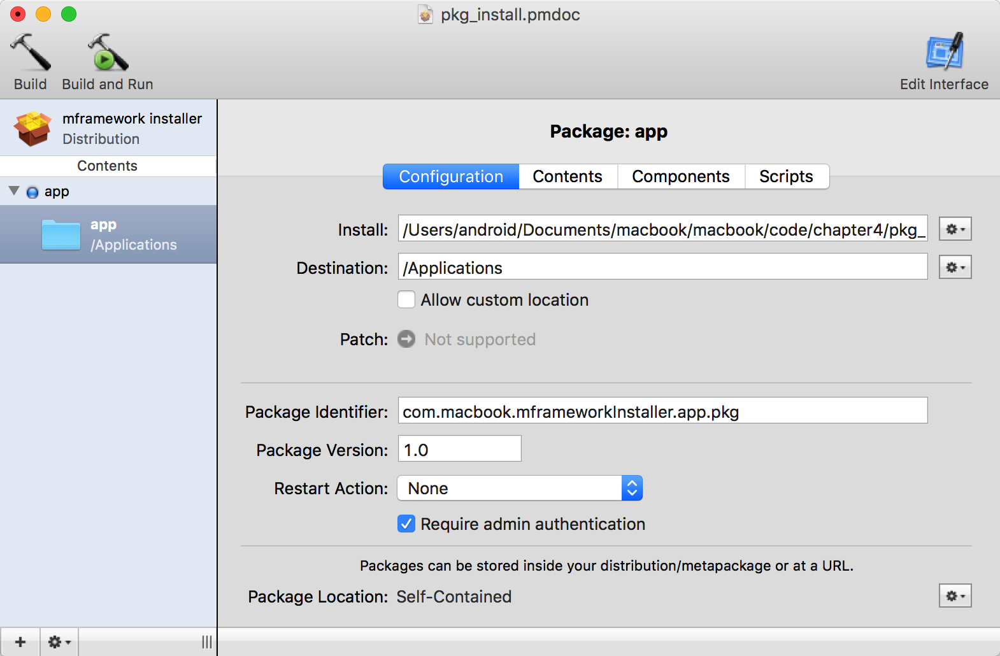
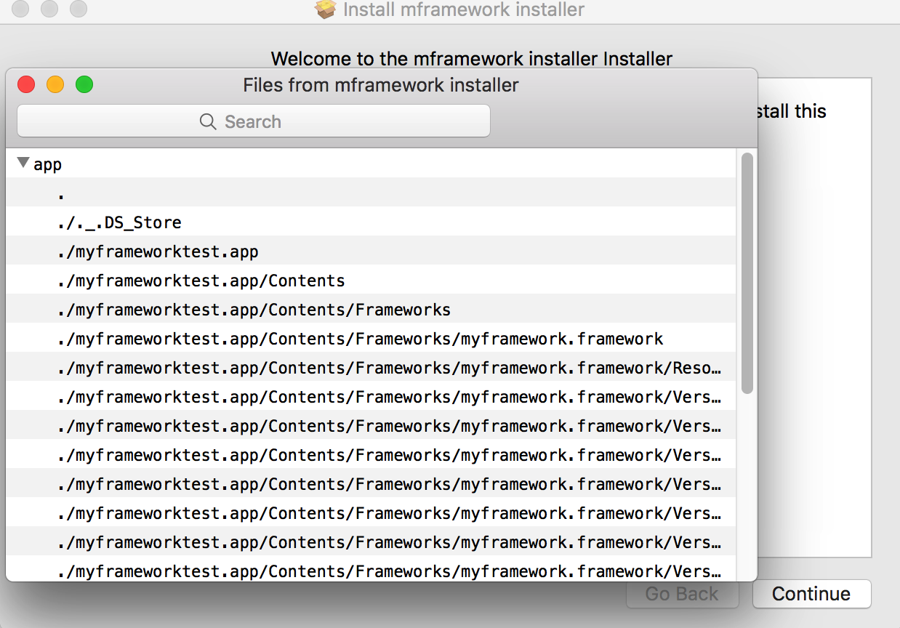
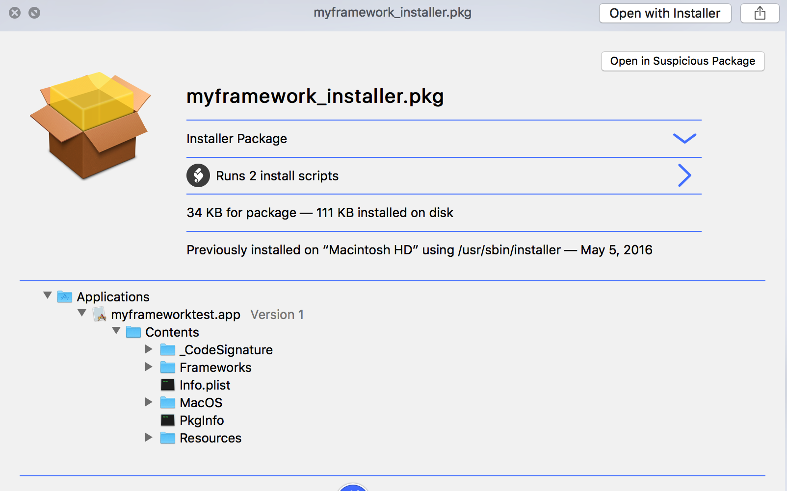
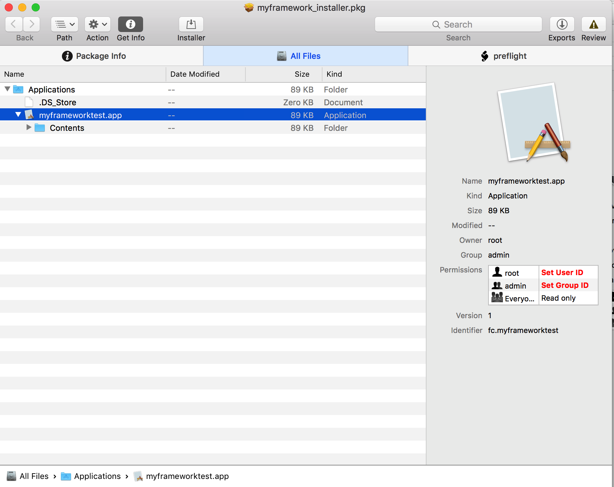
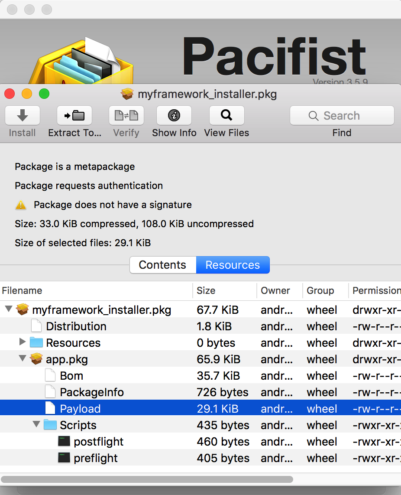

不同的操作系统都有专属于自己的软件安装包格式。如Ubuntu系统上的deb安装包，Windows系统上的msi安装包等。macOS系统使用pkg作为软件安装包格式。

大多数macOS上开发的程序都不需要安装程序，它们只是一个以app结尾的Bundle包，使用zip压缩一下，或者dmg制作一份镜像，是这类程序的主要发布方式。然而，一些App有一些特定的需求，比如：向系统配置面板写配置程序、安装屏幕保护程序、读写特定的目录与文件等。此时就可以制作pkg安装包程序来安装这类特殊的程序了。当然，由于这些特殊性，pkg安装程序无法通过苹果官方商店来发布。

### 0x1 构建pkg
pkg安装程序能够扩展程序安装内容以及读写特定目录的特性，来源于pkg支持的脚本特性，pkg安装程序允许开发人员在程序的安装过程中，运行自己编写的Bash脚本程序。

苹果官方在低版本的`Xcode`工具中提供了`PackageMaker`用来制作pkg，该工具没有直接包含在`XCode`开发套件中，如果要使用它，需要到苹果的开发者官网上去下载它。下载安装好该工具后，运行PackageMaker.app就可以制作pkg了。

本小节制作一个pkg安装包，完成以下目标：将上一小节的myframeworktest程序安装到Applications目录下，随便将myframework.framework框架安装到~/Library/frameworks目录中。启动`PackageMaker`，点击菜单File->New，在弹出的对话框中，在Organization一栏输入机构信息，如“com.macbook”，点击OK返回程序主界面，点击File->Save，将工程保存为pkg_install.pmdoc。

将上一小节的myframeworktest程序放到app目录下，将app目录直接拖入`PackageMaker`的主界面，会自己加程序添加配置信息，点击Configuration可以设置一些安装时的配置信息，如图所示：

`install`指定要安装的程序路径，这里已经指定好了；`Destination`指定程序要安装的位置，默认为“/Applications”目录；取消勾选“Allow custom location”选项，让程序只能安装到/Applications目录下，`Package Identifier`指定安装包的标识符，macOS记录安装过的pkg就是通过它来识别的，手动卸载pkg时需要用到它；`Package Version`指定安装包的版本，版本号是识别pkg版本升级的关键，为pkg指定升级脚本时需要用到；`Restart Action`指定pkg安装完成后，是否需要执行注销、关机或重启等操作；`Require admin authentication`复选框指定安装器需要管理员权限，为pkg指定的安装脚本如果需要管理员权限的话，就需要在此勾选上。
配置好后，点击Contents标签，配置需要安装的内容，`PackageMaker`已经默认选择好了要安装的内容为myframeworktest.app，并且文件的读写与执行权限也自动设置好了，如图所示：

关于文件的读写权限设罢，一个建议的设置如下表所示：

**表4.1 Contents权限设置**

|            | Owner | Group | Permissions|
|------------|-------|-------|------------|
|Applications| root  | admin | rwxrwxr-x  |
|System      | root  | admin | rwxrwxr-x  |
|Library     | root  | admin | rwxrwxr-x  |
|Extensions  | root  | admin | rwxrwxr-x  |
关于拖入Contents中的程序，这里有一个技巧！macOS系统会为操作过的文件夹中生成一个隐藏的`.DS_Store`文件，如果系统开启了显示隐藏文件的选项，直接打包程序会在安装包中包含隐藏的`.DS_Store`文件，需要在拖入Contents前将它们全部删除，可以使用如下的命令：
```
find ./ -name ".DS_Store" -exec rm -f {} \;
```
点击Components标签，配置组件信息。取消掉“Allow Relocation”复选框，否则即使提示安装完成，在/Applications目录下也看不到安装后的程序。如图所示：

点击Scripts标签，配置运行安装器时需要执行的脚本。将编写好的脚本分别保存为preflight与postflight，然后将它们放到script目录下，执行以下命令为它们赋上可执行权限：
```
$ chmod a+x ./preinstall
$ chmod a+x ./postflight
```
将script目录直接拖入Scripts Directory旁的文本框中，此时，Preflight与Postflight脚本会自动设置完成。如图所示：

可以设置的脚本有六个，它们按照执行顺序分别是：
- preflight：点击安装界面上的Install按钮时运行此脚本。该脚本在程序每次安装时都会运行。
- preinstall/preupgrade：针对单程序安装包（pkg），该脚本会在preflight脚本运行之后运行，针对多程序安装包（mpkg），该脚本会在用户按下Install铵钮后执行。preinstall与preupgrade的区别在于：preinstall只会在用户第一次安装该程序时执行，而preupgrade相反，如果之前安装过该程序，那么该脚本才会执行，preupgrade用于软件升级时使用。区分程序是否为第一次安装是通过pkg安装器Installer.app来完成的，Installer.app通过查看/private/var/db/receipts目录，查看目录中是否有以程序包名命名的pkg文件，如果存在，说明已经安装过，反之，为第一次安装。
- postinstall/postupgrade：该脚本在程序安装完之后才运行。它们的区别与preinstall/preupgrade一样。
- postflight：该脚本在postinstall/postupgrade脚本之后运行。
`PackageMaker`支持Shell脚本与Perl脚本，此处编写的是Shell脚本，preinstall脚本的内容如下：

```
#!/usr/bin/env bash

echo "Running myframeworktest.app preinstall script."
echo "Killing myframeworktest.app."
killall "myframeworktest"

echo "Finding old versions of myframeworktest."
mdfind -onlyin /Applications "kMDItemCFBundleIdentifier=='fc.myframeworktest'" | xargs -I % rm -rf %

echo "Removed old versions of myframeworktest.app, if any."
echo "Ran myframeworktest.app preinstall script."

exit 0
```
这段脚本首先使用killall杀掉正在运行的myframeworktest.app进程；接着使用`mdfind`在/Applications目录下查找程序标识符为”fc.myframeworktest“的程序包路径，找到后使用`rm -rf`将其删除掉。

再来看看postflight脚本的内容：
```
#!/usr/bin/env bash

echo "Running myframeworktest.app postinstall script."
echo "Installing myframework.framework."

rm -rf ~/Library/Frameworks/myframework.framework
mkdir ~/Library/Frameworks/myframework.framework
cp -r /Applications/myframeworktest.app/Contents/Frameworks/myframework.framework/* ~/Library/Frameworks/myframework.framework

chmod -R 6777 ~/Library/Frameworks/myframework.framework
echo "Ran myframeworktest.app postinstall script."

exit 0
```
该脚本运行时，myframeworktest.app程序包已经安装到了/Applications目录下，将myframework.framework拷贝到~/Library/Frameworks目录下，然后修改它的权限为任何人都可读可写可执行，最后执行完后调用"exit 0"退出脚本。

配置好要安装的内容与执行脚本后，点击Contents上面的图标，对pkg进行配置，点击Configuration，在Title旁的文本框中输入安装包的标题，例如”mframeworktest installer“；User Sees处选择Easy Install Only（简单安装）即可；Install Destination处勾选Volume selected by user。

点击Requirements标签，设置pkg运行的系统要求。点击界面左下角的加号”＋“按钮，添加两条规则：一条是System OS Version(e.g. 10.x.x)，另一条是Target OS Version(e.g. 10.x.x)，都设置成”>=“10.6，如图所示：


最后的Actions标签页不用去管它。配置完了后，还可以点击界面右上角的Edit interface按钮来编辑安装程序的界面。包括：Background、Introduction、Read me、License与Finish up。它们每一项都是一个页面，内容可以选择系统默认的Default，也可以直接写一段文本甙入（Embedded）进去，或者选择一个外部的rtf文档或html网页。如图所示，为一段手写的Read Me：


以上所有操作完成后，点击`PackageMaker`左上角的Build铵钮进行构建，或者Build and Run按钮构建成功后直接运行。构建完成后会针对单程序安装包或多程序安装包生成一个pkg或mpkg文件，该文件是最终可以发布的产品，接下来只需要对其进行安装测试，没问题就可以发布了。

在新版本的`XCode`中，提供了命令行工具`productbuild`来打包制作pkg。本小节`PackageMaker`操作的步骤可以执行以下命令完成：
```
$ productbuild --component app/myframeworktest.app /Applications --scripts script  ~/Desktop/out.pkg
```
命令执行完后，就会在当前用户桌面上生成pkg文件，当然编译时可以指定`--sign`参数来为pkg签名，pkg的签名不是使用`codesign`，如果创建pkg时没有对其进行签名，或者手动修改过pkg的内容，可以使用工具`productsign`来对pkg进行签名。

介绍了官方的pkg创建工具后，再来看看目前市面上常用的pkg制作工具。
喜欢命令行编译的开发人员一定会喜欢工具`Luggage`（下载地址：“https://github.com/unixorn/luggage”），它提供了一种自定义脚本的方式来编译构建pkg文件。该工具的使用方法很简单，只需要将整个github上的文件复制到/usr/local/share/luggage就完成了安装。至于脚本如何编写，可以参考`Luggage`提供的样例，
地址为“https://github.com/unixorn/luggage-examples”，以编译样例中的fex程序为例，在命令行下执行以下命令：
```
$ make

Usage

make clean - clean up work files.
make dmg   - roll a pkg, then stuff it into a dmg file.
make zip   - roll a pkg, then stuff it into a zip file.
make pkg   - roll a pkg.
make pkgls - list the bill of materials that will be generated by the pkg.

$ make pkg
Password:
make -f Makefile -e pack-fex

Disabling bundle relocation.
If you need to override permissions or ownerships, override modify_packageroot in your Makefile
Creating /tmp/the_luggage/Fex-20160902/payload/Fex-20160902.pkg with /usr/bin/pkgbuild.
sudo /usr/bin/pkgbuild --root /tmp/the_luggage/Fex-20160902/root \
       		--component-plist /tmp/the_luggage/Fex-20160902/luggage.pkg.component.plist \
       		--identifier com.huronhs.Fex \
       		--filter "/CVS$" --filter "/\.svn$" --filter "/\.cvsignore$" --filter "/\.cvspass$" --filter "/(\._)?\.DS_Store$" --filter "/\.git$" --filter "/\.gitignore$" \
       		--scripts /tmp/the_luggage/Fex-20160902/scripts \
       		--version 20160902 \
       		--ownership preserve --quiet \
       		/tmp/the_luggage/Fex-20160902/payload/Fex-20160902.pkg

$ ls
Fex-20160902.pkg       	Makefile       		fex
```
从输出中可以看出，除了构建pkg，`Luggage`还支持生成dmg与zip打包的程序，非常方便。

与`Luggage`类似的还有`createOSXinstallPkg`（下载地址：“https://github.com/munki/createOSXinstallPkg”），使用方法也很简单，有兴趣的读者可以到github页面上查看如何使用。

最后，还有一款免费强大的pkg安装包制作工具`Iceberg`（下载地址：http://s.sudre.free.fr/Software/Iceberg.html ），该工具可以修改安装程序界面的背景图片，此处就不去讨论它的用法了，有兴趣的读者可以去它的官网下载了试试。


### 0x2 pkg的安装与卸载
安装pkg很简单，只要双击pkg，或者双击mpkg，就会弹出安装向导，按照步骤不停点击Next，直到安装完成，安装过程中，可能执行一些操作可能会需要管理器权限，系统会弹出提示要求用户输入管理员密码，按照操作输入密码即可。除了双击安装外，还可以使用命令行工具`installer`进行静默安装，执行以下命令可以安装上一小节的pkg：
```
$ sudo installer -pkg ./myframework_installer.pkg -target LocalSystem
Password:
installer: Package name is myframework installer
installer: Upgrading at base path /
installer: The upgrade was successful.
```

pkg的卸载就没这么简单了！苹果公司没有提供直接卸载pkg的方法，上一小节没有制作pkg格式的卸载程序，而是编写了一个简单的脚本，只需要双击运行它就可以卸载上一节制作的pkg。脚本的代码如下：
```
#!/usr/bin/env bash

if [ -d ~/Library/Frameworks/myframework.framework ]; then
   /bin/rm -rf ~/Library/Frameworks/myframework.framework
fi

if [ -d /Application/myframework.app ]; then
   /bin/rm -rf /Applications/myframeworktest.app
fi

echo done.
```
对于没有提供卸载程序的pkg，卸载它们就只能手动或者依赖第三方的工具。例如`UninstallPKG`（下载地址：http://www.corecode.at/uninstallpkg ），这是一个收费软件，安装并运行该软件后，它会收集系统中安装的所有pkg软件，然后使用列表形式展示出来，如图所示：

点击View Package...按钮，可以查看pkg在系统中写入了哪些文件内容，点击Uninstall Package...可以直接卸载pkg。

`UninstallPKG`是如何做到收集与卸载系统中安装的pkg呢？其实它的原理并不难。它通过读取/private/var/db/receipts下的pkg列表，然后使用`lsbom`查看这些pkg文件的bom信息，找到bom文件中保存的文件列表，将它们列举出来，卸载的时候将它们全部删除即可。执行如下的命令列表可以查看上一小节pkg的信息：
```
$ cd /private/var/db/receipts
$ ls | grep macbook
com.macbook.myframeworkInstaller.pkg.bom
com.macbook.myframeworkInstaller.pkg.plist
$  lsbom -pf ./com.macbook.myframeworkInstaller.pkg.bom
.
./myframeworktest.app
./myframeworktest.app/Contents
./myframeworktest.app/Contents/Frameworks
./myframeworktest.app/Contents/Frameworks/myframework.framework
./myframeworktest.app/Contents/Frameworks/myframework.framework/Resources
./myframeworktest.app/Contents/Frameworks/myframework.framework/Versions
./myframeworktest.app/Contents/Frameworks/myframework.framework/Versions/A
./myframeworktest.app/Contents/Frameworks/myframework.framework/Versions/A/Resources
./myframeworktest.app/Contents/Frameworks/myframework.framework/Versions/A/Resources/Info.plist
./myframeworktest.app/Contents/Frameworks/myframework.framework/Versions/A/_CodeSignature
./myframeworktest.app/Contents/Frameworks/myframework.framework/Versions/A/_CodeSignature/CodeResources
./myframeworktest.app/Contents/Frameworks/myframework.framework/Versions/A/myframework
./myframeworktest.app/Contents/Frameworks/myframework.framework/Versions/Current
./myframeworktest.app/Contents/Frameworks/myframework.framework/myframework
./myframeworktest.app/Contents/Info.plist
./myframeworktest.app/Contents/MacOS
./myframeworktest.app/Contents/MacOS/myframeworktest
./myframeworktest.app/Contents/PkgInfo
./myframeworktest.app/Contents/Resources
./myframeworktest.app/Contents/Resources/Base.lproj
./myframeworktest.app/Contents/Resources/Base.lproj/MainMenu.nib
./myframeworktest.app/Contents/_CodeSignature
./myframeworktest.app/Contents/_CodeSignature/CodeResources
```
可以看出，脚本中执行的命令，在~/Library/Frameworks目录中安装的myframework.framework并没有列出来，而只有在Contents中指定的内容。上面查看bom信息使用的`lsbom`命令，其实，查看pkg中的内容还有一种更简单的方法，在双击运行pkg后，不要点击Continue按钮，而是点击菜单File->Show Files，pkg中包含的文件内容就一目了然了，如图所示：

除了手动的去/private/var/db/receipts目录下读取pkg列表，还可以使用pkg管理工具`pkgutil`来查看系统中安装的pkg信息，不过只有查看功能，不能卸载。执行如下命令可以查看上一节安装的pkg信息，效果与上面一样：
```
$ pkgutil --pkgs | grep -i com.macbook
com.macbook.myframeworkInstaller.pkg
$ pkgutil --files com.macbook.myframeworkInstaller.pkg
myframeworktest.app
myframeworktest.app/Contents
myframeworktest.app/Contents/Frameworks
myframeworktest.app/Contents/Frameworks/myframework.framework
myframeworktest.app/Contents/Frameworks/myframework.framework/Resources
myframeworktest.app/Contents/Frameworks/myframework.framework/Versions
myframeworktest.app/Contents/Frameworks/myframework.framework/Versions/A
myframeworktest.app/Contents/Frameworks/myframework.framework/Versions/A/Resources
myframeworktest.app/Contents/Frameworks/myframework.framework/Versions/A/Resources/Info.plist
myframeworktest.app/Contents/Frameworks/myframework.framework/Versions/A/_CodeSignature
myframeworktest.app/Contents/Frameworks/myframework.framework/Versions/A/_CodeSignature/CodeResources
myframeworktest.app/Contents/Frameworks/myframework.framework/Versions/A/myframework
myframeworktest.app/Contents/Frameworks/myframework.framework/Versions/Current
myframeworktest.app/Contents/Frameworks/myframework.framework/myframework
myframeworktest.app/Contents/Info.plist
myframeworktest.app/Contents/MacOS
myframeworktest.app/Contents/MacOS/myframeworktest
myframeworktest.app/Contents/PkgInfo
myframeworktest.app/Contents/Resources
myframeworktest.app/Contents/Resources/Base.lproj
myframeworktest.app/Contents/Resources/Base.lproj/MainMenu.nib
myframeworktest.app/Contents/_CodeSignature
myframeworktest.app/Contents/_CodeSignature/CodeResources
```


### 0x3 pkg文件格式
pkg分为pkg与mpkg，前者是针对单程序安装；后者是针对多程序安装，它包含一个或多个的子包（Sub Package）。pkg本身又有两种格式，一种是与Bundle一样，有着特定组织结构的目录，上一小节生成的pkg的安装包就是这种格式的，还有一种是xar格式的文件，下面分别对这两种格式的安装包进行分析。

首先看myframework_installer.mpkg，使用`tree`命令（系统默认没有此命令，可以使用“brew install tree”进行安装）查看它的目录结构如下：
```
$ tree ./myframework_installer.mpkg/
./myframework_installer.mpkg/
└── Contents
    ├── Packages
    │   └── app.pkg
    │       └── Contents
    │           ├── Archive.bom
    │           ├── Archive.pax.gz
    │           ├── Info.plist
    │           ├── PkgInfo
    │           └── Resources
    │               ├── en.lproj
    │               │   └── Description.plist
    │               ├── package_version
    │               ├── postflight
    │               └── preflight
    ├── Resources
    │   └── en.lproj
    └── distribution.dist

8 directories, 9 files
```
对于外层的mpkg，它的Packages目录下存放的是pkg文件列表，也就是子包列表；Resources目录存放了pkg用到的资源、如本地化资源、图像、rtf文档、pdf文档等；还有一个distribution.dist文件，这是一个xml文档，包含了要安装的子包、运行时脚本等信息。对于当前的mpkg，它的内容如下：
```
<?xml version="1.0" encoding="utf-8" standalone="no"?>
<installer-script minSpecVersion="1.000000" authoringTool="com.apple.PackageMaker" authoringToolVersion="3.0.6" authoringToolBuild="201">
    <title>myframework installer</title>
    <options customize="never" allow-external-scripts="no" rootVolumeOnly="false"/>
    <installation-check script="pm_install_check();"/>
    <volume-check script="pm_volume_check();"/>
    <script>function pm_volume_check() {
  if(!(my.target.systemVersion &amp;&amp; /* &gt;= */ system.compareVersions(my.target.systemVersion.ProductVersion, '10.6') &gt;= 0)) {
    my.result.title = 'Failure';
    my.result.message = 'Installation cannot proceed, as not all requirements were met.';
    my.result.type = 'Fatal';
    return false;
  }
  return true;
}


function pm_install_check() {
  if(!(/* &gt;= */ system.compareVersions(system.version.ProductVersion, '10.6') &gt;= 0)) {
    my.result.title = 'Failure';
    my.result.message = 'Installation cannot proceed, as not all requirements were met.';
    my.result.type = 'Fatal';
    return false;
  }
  return true;
}
</script>
    <choices-outline>
        <line choice="choice0"/>
    </choices-outline>
    <choice id="choice0" title="app">
        <pkg-ref id="com.macbook.myframeworkInstaller.pkg"/>
    </choice>
    <pkg-ref id="com.macbook.myframeworkInstaller.pkg" installKBytes="108" version="1.0" auth="Root">file:./Contents/Packages/app.pkg</pkg-ref>
</installer-script>
```
`pm_install_check()`与`pm_volume_check()`分别做安装时检查与卷标检查，下面的choices-outline部分指定了安装时使用的choice，也就是选择执行哪个子包，对于当前mpkg包，它只有一个pkg，choice的id为“choice0”，指向的路径是“file:./Contents/Packages/app.pkg”。

app.pkg是要安装的子包，是一个pkg格式的Bundle结构的目录，它包含一个Contents子目录，里面有四个文件与一个目录Resources，它们分别是：
- Archive.bom：bom信息。存放的要安装写入的文件列表，可以使用“lsbom -pf”命令查看，效果与上一节讲到的一样。
- Archive.pax.gz：使用pax格式打包后，再使用gzip压缩的压缩包，它的内容就是要安装的内容，此处就是myframeworktest.app程序。可以执行以下命令进行解压：
```
$ cd ./myframework_installer.mpkg/Contents/Packages/app.pkg/Contents/
$ gunzip -d ./Archive.pax.gz
$ pax -rvf ./Archive.pax
.
./myframeworktest.app
./myframeworktest.app/Contents
./myframeworktest.app/Contents/_CodeSignature
./myframeworktest.app/Contents/_CodeSignature/CodeResources
./myframeworktest.app/Contents/Frameworks
./myframeworktest.app/Contents/Frameworks/myframework.framework
./myframeworktest.app/Contents/Frameworks/myframework.framework/myframework
./myframeworktest.app/Contents/Frameworks/myframework.framework/Resources
./myframeworktest.app/Contents/Frameworks/myframework.framework/Versions
./myframeworktest.app/Contents/Frameworks/myframework.framework/Versions/A
./myframeworktest.app/Contents/Frameworks/myframework.framework/Versions/A/_CodeSignature
./myframeworktest.app/Contents/Frameworks/myframework.framework/Versions/A/_CodeSignature/CodeResources
./myframeworktest.app/Contents/Frameworks/myframework.framework/Versions/A/myframework
./myframeworktest.app/Contents/Frameworks/myframework.framework/Versions/A/Resources
./myframeworktest.app/Contents/Frameworks/myframework.framework/Versions/A/Resources/Info.plist
./myframeworktest.app/Contents/Frameworks/myframework.framework/Versions/Current
./myframeworktest.app/Contents/Info.plist
./myframeworktest.app/Contents/MacOS
./myframeworktest.app/Contents/MacOS/myframeworktest
./myframeworktest.app/Contents/PkgInfo
./myframeworktest.app/Contents/Resources
./myframeworktest.app/Contents/Resources/Base.lproj
./myframeworktest.app/Contents/Resources/Base.lproj/MainMenu.nib
```
- Info.plist：pkg包的信息。如`CFBundleIdentifier`为pkg的标识；IFMajorVersion与IFMinorVersion分别为pkg的主版本与子版本号；IFPkgFlagInstalledSize为pkg安装后所需要占用的字节大小。
- PkgInfo：8字节的标识。表明是一个pkg文件。

Resources目录除了包含资源文件外，还包含了：
- package_version：它是包版本文件。也就是使用`PackageMaker`制作pkg时设置的版本号；
- postflight/preflight：pkg要执行的脚本文件。上一节中讲过，此处是未经过加密明文存放的。


另外一种是xar格式的文件，可以使用如下命令查看myframework_installer.pkg文件的格式：
```
$ file ./myframework_installer.pkg
./myframework_installer.pkg: xar archive - version 1
```
xar是压缩的可扩展归档格式，可以使用`xar`命令对其进行解压，执行如下命令解压：
```
$ xar -xvf ./myframework_installer.pkg
Distribution
app.pkg/PackageInfo
app.pkg/Bom
app.pkg/Payload
app.pkg/Scripts
app.pkg
Resources/en.lproj
Resources
```
Distribution与前面讨论的distribution.dist文件基本一样；Resources目录与前面的也一样；主要看app.pkg，它包含四个文件：
- Bom：bom信息，存放的要安装写入的文件列表。可以使用“lsbom -pf”命令查看，效果与上一节讲到的一样。
- PackageInfo：文本文件，包含了包的信息。可以使用`cat`命令查看它的内容：

```
$ cat app.pkg/PackageInfo

<pkg-info format-version="2" identifier="com.macbook.myframeworkInstaller.pkg" version="1.0" install-location="/Applications" auth="root">
    <payload installKBytes="108" numberOfFiles="25"/>
    <scripts>
        <preinstall file="./preflight"/>
        <postinstall file="./postflight"/>
    </scripts>
    <bundle id="fc.myframeworktest" CFBundleIdentifier="fc.myframeworktest" path="./myframeworktest.app" CFBundleVersion="1">
        <bundle id="fc.myframework" CFBundleIdentifier="fc.myframework" path="./Contents/Frameworks/myframework.framework" CFBundleVersion="1"/>
    </bundle>
    <bundle-version>
        <bundle id="fc.myframeworktest"/>
        <bundle id="fc.myframework"/>
    </bundle-version>
```
- Payload：经过gzip压缩过的数据内容，本处为要安装的myframework.app，可以使用如下命令进行解压：

```
$ cat ./Payload | cpio -i
3 blocks
```
解压成功后就会在当前目录下生成myframework.app。
- Scripts：经过gzip压缩过的脚本。可以使用如下命令进行解压：

```
$ cd app.pkg
$ cat ./Scripts | cpio -i
181 blocks
```
解压成功后就会在当前目录下生成未加密的preflight与postflight脚本。


### 0x4 破解pkg
对于pkg格式有一定了解后，修改或破解pkg就不会感到多难。破解pkg无非有以下三种：
- 资源的替换或修改：针对文件夹类型的pkg，未加密，可直接进行修改替换；针对xar类型的pkg，需要先解压xar，然后替换或修改完资源后，重新压缩xar。
- 安装脚本的替换或修改：针对文件夹类型的pkg，未加密，可直接进行修改替换；针对xar类型的pkg，需要先解压xar，然后解压Scripts，然后替换或修改完脚本后，重新压缩Scripts，最后重新压缩xar。
- 安装内容的替换或修改：针对文件夹类型的pkg，未加密，但需要先对Archive.pax.gz进行解包，修改完后，需要重新打包回去；针对xar类型的pkg，需要先解压xar，然后解压Payload，替换或修改完数据后，重新压缩Payload，最后重新压缩xar。

以上步骤是操作思路，实际分析过程中，使用工具来做一些辅助工作是可以大大提高效率的，在拿到pkg后，首先快速浏览pkg文件，简单分析出pkg的行为与可能要做的操作。推荐一款工具：`Suspicious Package`（下载地址：http://www.mothersruin.com/software/SuspiciousPackage ），此工具提供了快速浏览插件，安装完成后，在要操作的pkg上按下空格，就可以快速查看pkg，检索要安装的软件内容，如图所示：

还可以查看要执行的脚本的内容，如图所示：

对pkg有了初步了解后，找到需要操作的地方后，下一步就是提取数据内容了，`Suspicious Package`支持数据的提取，使用`Suspicious Package`打开pkg文件后，在主界面的All Files列就可以查看所有文件，可以选中要导出的文件，直接拖出到Finder，或者点击Action->Export，都可以将文件导出，操作效果如图所示：
  

除了`Suspicious Package`外，介绍另外一款更强大的工具：`Pacifist`（下载地址：http://www.charlessoft.com ），这款工具支持多种文件数据的提取，其中就包括pkg，如图所示：  
  
选中要提取的文件，右键选择“Extract to Custom Location...”，或者直接拖到要保存到的文件夹中，都可以将文件提取出来。

提取出来的文件，分析完成，修改好了后，就要打包回去了，`Pacifist`不支持将数据打包回去，如果修改的是Payload，可以使用如下命令将app目录下的myframeworktest.app打包回去：
```
find app/* | cpio -o > ./Payload
```
如果是脚本文件，也可以如法炮制，最后就是将修改好的Payload或Scripts重新打包回去，可以使用执行“`xar cvf`”命令来操作，这里推荐另一款图形化工具：`Flat Package Editor`，该工具是苹果官方提供的，与`PackageMaker`一起提供给开发人员，它可以对pkg直接进行增、删、改操作，使用`Flat Package Editor`打开要操作的pkg，将修改好的Payload或Scripts拖回去，然后，点击菜单File->Save就保存成功了！如图所示：

操作完成后，pkg就算修改好了，接下来测试安装没问题就算破解完成了。
