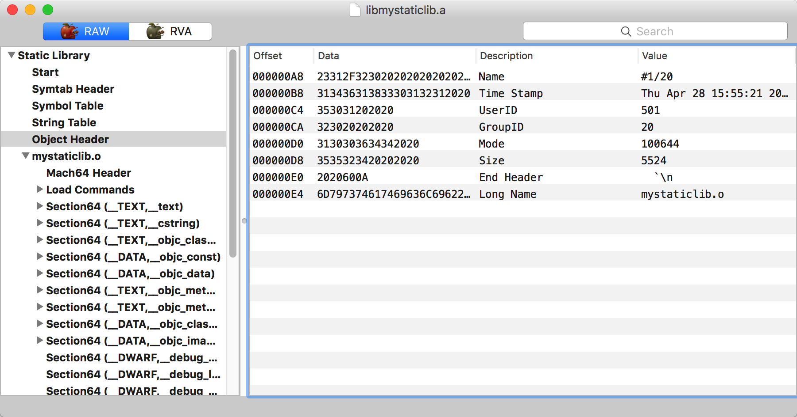

静态库与动态库都属于Mach-O格式的文件，动态库使用.dylib作为文件的扩展名，静态库的扩展名则是.a；在功能上，动态库通过动态链接的方式向其它程序提供接口，而静态库则是将功能代码直接编译进目标Mach-O文件中去，多个程序使用同一个动态库并不会增加目标文件的大小，使用静态库则会将每份功能代码都拷贝到目标文件中；从运行效率上来说，动态库需要在加载后做符号绑定操作，而静态库代码直接在目标程序中运行，理论上来讲，使用静态库的运行效率比动态库要高一些。


## 0x1 构建静态库
`XCode`提供了创建静态库的工程模板，创建静态库的方法与创建动态库几乎一样，唯一不同的是，在项目设置时，Type选择Static。还是与创建动态库一样的代码：
```
//mystaticlib.h
#import <Foundation/Foundation.h>

@interface mystaticlib : NSObject
-(void) hello;
@end

//mystaticlib.m
#import "mystaticlib.h"

@implementation mystaticlib
-(void) hello {
    NSLog(@"hello world");
}
@end
```
分别保存为mystaticlib.h与mystaticlib.m。然后使用xcodebuild编译会有如下输出：
```
$ xcodebuild
=== BUILD TARGET mystaticlib OF PROJECT mystaticlib WITH THE DEFAULT CONFIGURATION (Release) ===

Check dependencies

Write auxiliary files
write-file /Users/macbook/Documents/macbook/macbook/code/chapter4/mystaticlib/build/mystaticlib.build/Release/mystaticlib.build/mystaticlib-generated-files.hmap
write-file /Users/macbook/Documents/macbook/macbook/code/chapter4/mystaticlib/build/mystaticlib.build/Release/mystaticlib.build/mystaticlib-all-target-headers.hmap
......
/bin/mkdir -p /Users/macbook/Documents/macbook/macbook/code/chapter4/mystaticlib/build/mystaticlib.build/Release/mystaticlib.build/Objects-normal/x86_64
write-file /Users/macbook/Documents/macbook/macbook/code/chapter4/mystaticlib/build/mystaticlib.build/Release/mystaticlib.build/Objects-normal/x86_64/mystaticlib.LinkFileList

CompileC build/mystaticlib.build/Release/mystaticlib.build/Objects-normal/x86_64/mystaticlib.o mystaticlib/mystaticlib.m normal x86_64 objective-c com.apple.compilers.llvm.clang.1_0.compiler
    cd /Users/macbook/Documents/macbook/macbook/code/chapter4/mystaticlib
    export LANG=en_US.US-ASCII
    /Applications/Xcode.app/Contents/Developer/Toolchains/XcodeDefault.xctoolchain/usr/bin/clang -x objective-c -arch x86_64 -fmessage-length=94 -fdiagnostics-show-note-include-stack -fmacro-backtrace-limit=0 -fcolor-diagnostics -std=gnu99 -fobjc-arc -fmodules -gmodules -fmodules-prune-interval=86400 -fmodules-prune-after=345600 -fbuild-session-file=/var/folders/rd/mts0362j0n92rq0z1cnmdb580000gn/C/org.llvm.clang/ModuleCache/Session.modulevalidation -fmodules-validate-once-per-build-session -Wnon-modular-include-in-framework-module -Werror=non-modular-include-in-framework-module -Wno-trigraphs -fpascal-strings -Os -fno-common -Wno-missing-field-initializers -Wno-missing-prototypes -Werror=return-type -Wunreachable-code -Wno-implicit-atomic-properties -Werror=deprecated-objc-isa-usage -Werror=objc-root-class -Wno-arc-repeated-use-of-weak -Wduplicate-method-match -Wno-missing-braces -Wparentheses -Wswitch -Wunused-function -Wno-unused-label -Wno-unused-parameter -Wunused-variable -Wunused-value -Wempty-body -Wconditional-uninitialized -Wno-unknown-pragmas -Wno-shadow -Wno-four-char-constants -Wno-conversion -Wconstant-conversion -Wint-conversion -Wbool-conversion -Wenum-conversion -Wshorten-64-to-32 -Wpointer-sign -Wno-newline-eof -Wno-selector -Wno-strict-selector-match -Wundeclared-selector -Wno-deprecated-implementations -DNS_BLOCK_ASSERTIONS=1 -DOBJC_OLD_DISPATCH_PROTOTYPES=0 -isysroot /Applications/Xcode.app/Contents/Developer/Platforms/MacOSX.platform/Developer/SDKs/MacOSX10.11.sdk -fasm-blocks -fstrict-aliasing -Wprotocol -Wdeprecated-declarations -mmacosx-version-min=10.11 -g -Wno-sign-conversion -iquote /Users/macbook/Documents/macbook/macbook/code/chapter4/mystaticlib/build/mystaticlib.build/Release/mystaticlib.build/mystaticlib-generated-files.hmap -I/Users/macbook/Documents/macbook/macbook/code/chapter4/mystaticlib/build/mystaticlib.build/Release/mystaticlib.build/mystaticlib-own-target-headers.hmap -I/Users/macbook/Documents/macbook/macbook/code/chapter4/mystaticlib/build/mystaticlib.build/Release/mystaticlib.build/mystaticlib-all-target-headers.hmap -iquote /Users/macbook/Documents/macbook/macbook/code/chapter4/mystaticlib/build/mystaticlib.build/Release/mystaticlib.build/mystaticlib-project-headers.hmap -I/Users/macbook/Documents/macbook/macbook/code/chapter4/mystaticlib/build/Release/include -I/Users/macbook/Documents/macbook/macbook/code/chapter4/mystaticlib/build/mystaticlib.build/Release/mystaticlib.build/DerivedSources/x86_64 -I/Users/macbook/Documents/macbook/macbook/code/chapter4/mystaticlib/build/mystaticlib.build/Release/mystaticlib.build/DerivedSources -F/Users/macbook/Documents/macbook/macbook/code/chapter4/mystaticlib/build/Release -MMD -MT dependencies -MF /Users/macbook/Documents/macbook/macbook/code/chapter4/mystaticlib/build/mystaticlib.build/Release/mystaticlib.build/Objects-normal/x86_64/mystaticlib.d --serialize-diagnostics /Users/macbook/Documents/macbook/macbook/code/chapter4/mystaticlib/build/mystaticlib.build/Release/mystaticlib.build/Objects-normal/x86_64/mystaticlib.dia -c /Users/macbook/Documents/macbook/macbook/code/chapter4/mystaticlib/mystaticlib/mystaticlib.m -o /Users/macbook/Documents/macbook/macbook/code/chapter4/mystaticlib/build/mystaticlib.build/Release/mystaticlib.build/Objects-normal/x86_64/mystaticlib.o

Libtool build/Release/libmystaticlib.a normal x86_64
    cd /Users/macbook/Documents/macbook/macbook/code/chapter4/mystaticlib
    export MACOSX_DEPLOYMENT_TARGET=10.11
    /Applications/Xcode.app/Contents/Developer/Toolchains/XcodeDefault.xctoolchain/usr/bin/libtool -static -arch_only x86_64 -syslibroot /Applications/Xcode.app/Contents/Developer/Platforms/MacOSX.platform/Developer/SDKs/MacOSX10.11.sdk -L/Users/macbook/Documents/macbook/macbook/code/chapter4/mystaticlib/build/Release -filelist /Users/macbook/Documents/macbook/macbook/code/chapter4/mystaticlib/build/mystaticlib.build/Release/mystaticlib.build/Objects-normal/x86_64/mystaticlib.LinkFileList -o /Users/macbook/Documents/macbook/macbook/code/chapter4/mystaticlib/build/Release/libmystaticlib.a

** BUILD SUCCEEDED **
```
整个编译过程分为： 检查依赖（Check dependencies）、生成辅助文件（Write auxiliary files）、编译（CompileC）、打包生成库（Libtool）等几步。最终打包生成库的环节使用的`libtool`工具，该工具除了生成静态库，也可以生成动态库，上一节生成动态库使用链接器`ld`，它底层也是通过`libtool`来生成动态库的。最后，静态库不需要签名，静态库中的代码最终会被插入到目标程序中，由目标程序来签名。


## 0x2 静态库格式
上一节讲到的动态库文件，它的格式就是标准的Mach-O文件，它与Mach-O可执行文件不同的是，动态库在Mach-O头部指定文件类型为`MH_DYLIB`，可执行程序为`MH_EXECUTE`。与动态库不同的是，静态库文件不是标准的Mach-O，它的格式如下：
```
Start
Symtab Header
Symbol Table
String Table
Object Header 0
ObjName0.o
......
Object Header N
ObjNameN.o
```
`Start`为静态库的开始，它是一个固定长度的签名值“!&lt;arch&gt;\n”，十六进制为“21 3C 61 72 63 68 3E 0A”。

`Symtab Header`为符号表头，描述了符号表的信息。它使用`symtab_header`结构体表示，具体定义为：
```
struct symtab_header {
	char    	name[16];       /* 名称 */
	char    	timestamp[12];  /* 库创建的时间戳 */
	char        userid[6];    	/* 用户id */
	char    	groupid[char];  /* 组id */
    uint64_t    mode;        	/* 文件访问模式 */
    uint64_t    size;    		/* 符号表占总字节大小 */
    uint32_t    endheader;    	/* 头结束标志 */
	char    	longname[20];   /* 符号表长名 */
};
```

`Symbol Table`为当前静态库导出的符号表。它使用`symbol_table`结构体表示，具体定义为：
```
struct symbol_table {
	uint32_t   	size;       	/* 符号表占用的总字节数 */
	symbol_info syminfo[0];  	/* 符号信息，它的个数是 size / sizeof(symbol_info) */
};

struct symbol_info {
	uint32_t    symnameoff;  	/* 符号名在字符串表数据中的偏移值 */
	uint32_t    objheaderoff;  	/* 符号所属的目标文件的文件头在文件中的偏移值 */
};
```

`String Table`为字符串表，该结构体存储的字符串信息供符号表使用。使用`string_table`结构体表示，具体定义为：
```
struct string_table {
	uint32_t   	size;       	/* 字符串表占用的总字节数 */
	char 		data[size];  	/* 字符串数据 */
};
```

`Object Header`为目标文件的头，描述了接下来的目标文件的信息。使用`object_header`结构体表示，具体定义为：
```
struct object_header {
	char    	name[16];       /* 名称 */
	char    	timestamp[12];  /* 目标文件创建的时间戳 */
	char        userid[6];    	/* 用户id */
	char    	groupid[char];  /* 组id */
    uint64_t    mode;        	/* 文件访问模式 */
    uint64_t    size;    		/* 符号表占总字节大小 */
    uint32_t    endheader;    	/* 头结束标志 */
	char    	longname[20];   /* 符号表长名 */
};
```
`object_header`结构体的布局与`symtab_header`基本一样的。

ObjName.o：在`object_header`结构体下面紧接着就是具体的目标文件内容了。目标文件是以.o结尾的Mach-O格式的文件，它是由编译器生成的中间文件。目标文件在它的Mach-O头部被标识为`MH_OBJECT`类型的文件。

最后，可以使用`MachOView`查看本小节生成的libmystaticlib.a的结构信息，效果如图所示：



## 0x3 管理静态库
通过上一小节的分析，我们知道，静态库是由一些头信息加一系统的.o目标文件组成的。在分析静态库中的具体目标文件时，需要先将目标文件解压出来，还好目前主流的静态分析工具都支持直接读取静态库中的目标文件。但如果想要修改静态库中目标文件的内容，就需要先将目标文件取出后，修改后再替换回去，在了解了静态库文件格式后，完全可以自己动手写工具解出静态库中的目标文件，但实现上不用这么麻烦，可以使用库管理工具`ar`来完成该工作。

执行如下命令就可以解出上一小节生成的静态库中的目标文件：
```
$ ar -x ./libmystaticlib.a
```
操作成功后没有输出信息，但可以发现，当前目录中已经生成了mystaticlib.o文件。在修改完目标文件后，可以将其打包进原来的库，或者直接生成新的静态库，执行以下的命令：
```
$ ar rcs libmystaticlib_new.a *.o
```
同样没有输出信息，但ar已经成功将当前目录下所有的目标文件打包进了libmystaticlib_new.a中。
